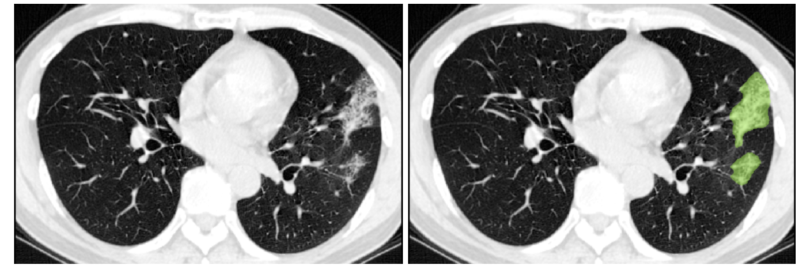
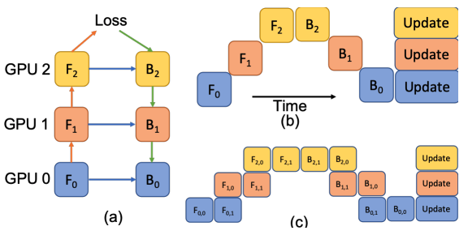
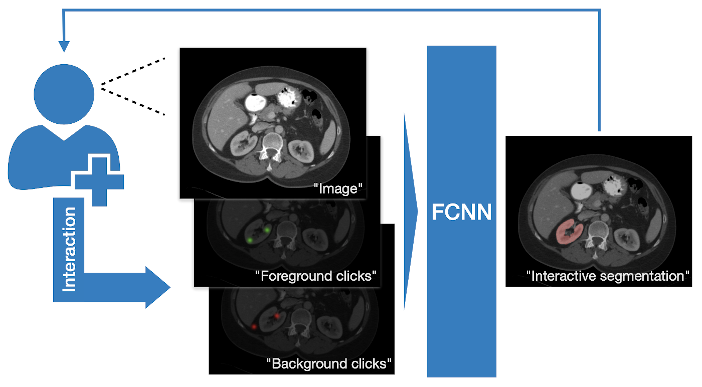
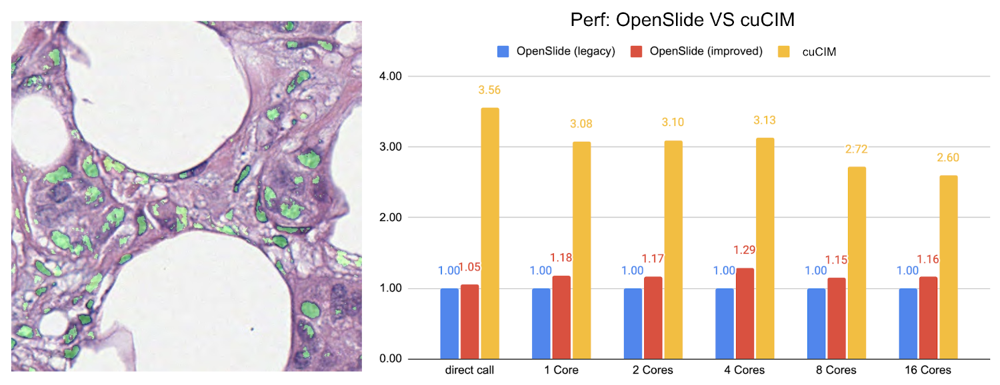
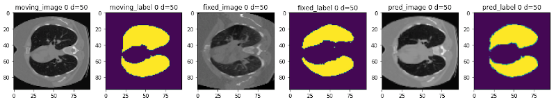

# Research and Application Highlights

### COPLE-Net for COVID-19 Pneumonia Lesion Segmentation
[A reimplementation](https://monai.io/research/coplenet-pneumonia-lesion-segmentation) of the COPLE-Net originally proposed by:

G. Wang, X. Liu, C. Li, Z. Xu, J. Ruan, H. Zhu, T. Meng, K. Li, N. Huang, S. Zhang. (2020) "A Noise-robust Framework for Automatic Segmentation of COVID-19 Pneumonia Lesions from CT Images." IEEE Transactions on Medical Imaging. 2020. [DOI: 10.1109/TMI.2020.3000314](https://doi.org/10.1109/TMI.2020.3000314)

### LAMP: Large Deep Nets with Automated Model Parallelism for Image Segmentation
[A reimplementation](https://monai.io/research/lamp-automated-model-parallelism) of the LAMP system originally proposed by:

Wentao Zhu, Can Zhao, Wenqi Li, Holger Roth, Ziyue Xu, and Daguang Xu (2020) "LAMP: Large Deep Nets with Automated Model Parallelism for Image Segmentation." MICCAI 2020 (Early Accept, paper link: https://arxiv.org/abs/2006.12575)

### DiNTS: Differentiable Neural Network Topology Search for 3D Medical Image Segmentation
MONAI integrated the `DiNTS` module to support more flexible topologies and joint two-level search. It provides a topology guaranteed discretization algorithm and a discretization aware topology loss for the search stage to minimize the discretization gap, and a cost usage aware search method which can search 3D networks with different GPU memory requirements. For more details, please check the [DiNTS tutorial](https://monai.io/research/dints.html).

### Accounting for Dependencies in Deep Learning Based Multiple Instance Learning for Whole Slide Imaging
For [classification of digital pathology whole slide images (WSI)](https://arxiv.org/abs/2111.01556), MONAI introduces new transforms and network modules for multiple instance learning. These include self-attention transformer blocks for explicitly accounting of the dependencies between instances (image patches) during training. For more details, please check out the [multiple instance learning tutorial](https://github.com/Project-MONAI/tutorials/tree/master/pathology/multiple_instance_learning). 

### Self-supervised representation learning
MONAI starts to explore self-supervised representation learning in this milestone release. The Vision Transformer has been extended to learn from self-supervised reconstruction tasks with various data augmentation and a regularized contrastive loss. The weights of the pre-trained backbone could be used to enhance the performance of the novel downstream deep learning tasks.

The [tutorial](https://github.com/Project-MONAI/tutorials/tree/master/self_supervised_pretraining) shows how to generate a good set of pre-trained weights using unlabeled data with self-supervised tasks, then use the pre-trained weights to perform fine-tuning on a fully supervised volumetric segmentation task using a transformer based `UNETR`.

### Swin UNETR model for the task of multi-organ segmentation
For [Swin UNETR: Swin Transformers for Semantic Segmentation of Brain Tumors in MRI Images](https://arxiv.org/abs/2201.01266), MONAI introduces new network modules for multi-organ segmentation task using the BTCV challenge dataset. The architecture of Swin UNETR:

The [tutorial](https://github.com/Project-MONAI/tutorials/blob/main/3d_segmentation/swin_unetr_btcv_segmentation_3d.ipynb) shows a typical pipeline of multi-organ segmentation based on Swin UNETR model, DiceCE loss function, Mean Dice, etc. And we used weights from self-supervised pre-training of Swin UNETR encoder (3D Swin Transformer) on a cohort of 5050 CT scans from publicly available datasets.

### DeepGrow modules for interactive segmentation
[A reimplementation](https://github.com/Project-MONAI/MONAI/tree/master/monai/apps/deepgrow) of the DeepGrow components, which is deep learning based semi-automated segmentation approach that aims to be a "smart" interactive tool for region of interest delineation in medical images, originally proposed by:

Sakinis, Tomas, et al. "Interactive segmentation of medical images through fully convolutional neural networks." arXiv preprint arXiv:1903.08205 (2019).

### DeepEdit workflow for interactive segmentation
DeepEdit is a method that combines an automatic and a semi-automatic approach for 3D medical images into a single deep learning-based model. The [implementation](https://github.com/Project-MONAI/MONAI/tree/dev/monai/apps/deepedit) of the DeepEdit modules provides essential components for interactive segmentation. More details are available in the training and inference [tutorial](https://github.com/Project-MONAI/tutorials/tree/main/deepedit/ignite).

The following figure shows the typical workflow of interactive segmentation:

### NuClick modules for interactive nuclei segmentation
NuClick is a CNN-based approach to speed up collecting annotations for microscopic objects requiring minimum interaction from the annotator. The [implementation](https://github.com/Project-MONAI/MONAI/tree/dev/monai/apps/nuclick) contains essential components for the training and inference workflows of NuClick interactive nuclei segmentation.

The following figure is example outputs of NuClick (annotator click inside the nucleus and the mask will be generated by CNN):

### Lesion detection in digital pathology
[Implementation](https://github.com/Project-MONAI/MONAI/tree/master/monai/apps/pathology) of the pathology detection components, which includes efficient whole slide imaging IO and several patch sampling methods with NVIDIA cuCIM library and SmartCache mechanism, FROC measurements for lesion and probabilistic post-processing for lesion detection.

### Learning-based image registration
Starting from v0.5.0, MONAI provides experimental features for building learning-based 2D/3D registration workflows.  These include image similarity measures as loss functions, bending energy as model regularization, network architectures, warping modules. The components can be used to build the major unsupervised and weakly-supervised algorithms.

The following figure shows the registration of CT images acquired at different time points for a single patient using MONAI:

### 2D and 3D detection workflow
The [implementation](https://github.com/Project-MONAI/MONAI/tree/dev/monai/apps/detection) contains 2D and 3D bounding box detection components of `RetinaNet`, which includes：bounding box operations, hard negative sampler, and RetinaNet detectors.

The following figure shows the detection training and inference workflows:

### Reproducing the state-of-the-art Kaggle competition solutions
[A reimplementation](https://github.com/Project-MONAI/tutorials/tree/master/kaggle/RANZCR/4th_place_solution) of the 4th place solution of RANZCR CLiP - Catheter and Line Position Challenge in Kaggle: https://www.kaggle.com/c/ranzcr-clip-catheter-line-classification
