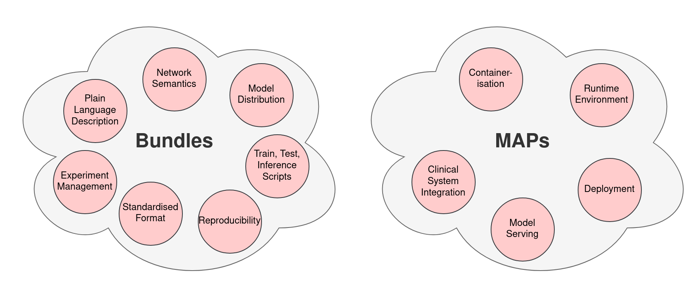

:github_url: https://github.com/Project-MONAI/MONAI

Bundle
======

MONAI Bundles are a specification and file structure based way of distributing trained MONAI models with associated
metadata, code, documentation, and other resources. These are meant to make it easier for you to distribute your model
in a format that explains what the model is for, how to use it, how to reproduce the science you've done with it, and
use it in other applications such as Label and Deploy.

.. toctree::
   :maxdepth: 1

   mb_specification
   config_syntax.md
   mb_properties

Detailed bundle examples and get started tutorial: https://github.com/Project-MONAI/tutorials/tree/main/bundle

A collection of medical imaging models in the MONAI Bundle format: https://github.com/Project-MONAI/model-zoo

Bundle vs. MAPs
---------------

Bundles differ from MONAI Application Packages (MAPs) in that they focus on description, code definition, application,
usage. MAPs focus on deployment, containerisation, integration into existing clinical systems, and other application
areas relating to putting models into use.

As a user, bundles are networks and "programs" you would use directly for training, inference, reproducing results,
and other tasks. Bundles can be integrated into MONAI Label apps to perform segmentation tasks through user interfaces,
or into MAPs for deployment. They can be integrated into other container environments but this isn't their focus. A
bundle in general is a more lightweight concept with less infrastructure

For all applications relating to containerisation, portability, and deployment, MAPs are what you're looking for. A MAP
is the contained environment for running an inference application directly or within an orchestration system. A bundle
alone doesn't have the structure suitable for this use, a MAP must be provided which uses a bundle as the inference object.
MAPs are also meant for inference only unlike bundles which should include training scripts. DICOM access is emphasised in
MAPs since they are meant for clinical deployment and so must interface with clinical databases.
