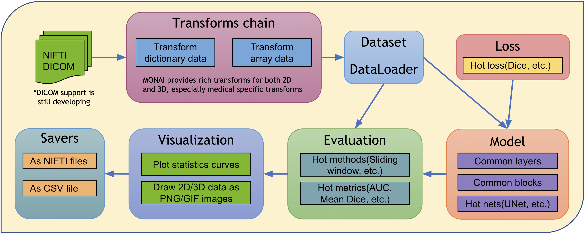

# Modules for public alpha

MONAI aims at supporting deep learning in medical image analysis at multiple granularities.
This figure shows modules currently available in the codebase.

The rest of this page provides more details for each module.

* [Data I/O, preprocessing, and augmentation](#medical-image-data-io-preprocessing-and-augmentation)
* [Loss functions](#losses)
* [Network architectures](#network-architectures)
* [Evaluation](#evaluation)
* [Visualization](#visualization)
* [Result writing](#result-writing)

## Medical image data I/O, preprocessing, and augmentation
Medical images require highly specialized methods for I/O, preprocessing, and
augmentation. Medical images are often in specialized formats with rich
meta-information, and the data volumes are often high-dimensional. These
require carefully designed manipulation procedures. The medical imaging focus
of MONAI is enabled by powerful and flexible image transformations that
facilitate user-friendly, reproducible, optimized medical data pre-processing
pipelines.

### 1. Transforms support both Dictionary and Array format data
1. The widely used computer vision packages (such as ``torchvision``) focus on
   spatially 2D array image processing. MONAI provides more domain-specific
   transformations for both spatially 2D and 3D and retains the flexible
   transformation "compose" feature.
2.  As medical image preprocessing often requires additional fine-grained
    system parameters, MONAI provides transforms for input data encapsulated in
    python dictionaries. Users can specify the keys corresponding to
    the expected data fields and system parameters to compose complex
    transformations.

### 2. Medical specific transforms
MONAI aims at providing a rich set of popular medical image specific
transformations. These currently include, for example:


- `LoadNifti`:  Load Nifti format file from provided path
- `Spacing`:  Resample input image into the specified `pixdim`
- `Orientation`: Change the image's orientation into the specified `axcodes`
- `RandGaussianNoise`: Perturb image intensities by adding statistical noises
- `NormalizeIntensity`: Intensity Normalization based on mean and standard deviation
- `Affine`: Transform image based on the affine parameters
- `Rand2DElastic`: Random elastic deformation and affine in 2D
- `Rand3DElastic`: Random elastic deformation and affine in 3D

### 3. Fused spatial transforms and GPU acceleration
As medical image volumes are usually large (in multi-dimensional arrays),
pre-processing performance obviously affects the overall pipeline speed. MONAI
provides affine transforms to execute fused spatial operations, supports GPU
acceleration via native PyTorch to achieve high performance.

For example:
```py
# create an Affine transform
affine = Affine(
    rotate_params=np.pi/4,
    scale_params=(1.2, 1.2),
    translate_params=(200, 40),
    padding_mode='zeros',
    device=torch.device('cuda:0')
)
# convert the image using bilinear interpolation
new_img = affine(image, spatial_size=(300, 400), mode='bilinear')
```

### 4. Randomly crop out batch images based on positive/negative ratio
Medical image data volume may be too large to fit into GPU memory. A
widely-used approach is to randomly draw small size data samples during
training and run a “sliding window” routine for inference.  MONAI currently
provides general random sampling strategies including class-balanced fixed
ratio sampling which may help stabilize the patch-based training process.

### 5. Deterministic training for reproducibility
Deterministic training support is necessary and important for deep learning
research, especially in the medical field. Users can easily set the random seed
to all the transforms in MONAI locally and will not affect other
non-deterministic modules in the user's program.
For example:
```py
# define a transform chain for pre-processing
train_transforms = monai.transforms.Compose([
    LoadNiftid(keys=['image', 'label']),
    RandRotate90d(keys=['image', 'label'], prob=0.2, spatial_axes=[0, 2]),
    ... ...
])
# set determinism for reproducibility
train_transforms.set_random_state(seed=0)
```
Users can also enable/disable deterministic training directly:
```py
monai.utils.set_determinism(seed=0, additional_settings=None)
```

### 6. Cache IO and transforms data to accelerate training
Users often need to train the model with many (potentially thousands of) epochs
over the data to achieve the desired model quality. A native PyTorch
implementation may repeatedly load data and run the same preprocessing steps
for every epoch during training, which can be time-consuming and unnecessary,
especially when the medical image volumes are large.
MONAI provides a caching mechanism to accelerate these transformation steps
during training by storing the intermediate outcomes before the first
randomized transform in the transform chain. Enabling this feature could
potentially give 10x training speedups.


A PersistentDataset is similar to the CacheIO, where the intermediate cache
values are persisted to disk storage for rapid retrieval between experimental
runs (as is the case when tuning hyper parameters), or when the entire data set
size exceeds available memory.

## Losses
There are domain-specific loss functions in the medical imaging research which
are not typically used in the generic computer vision tasks. As an important
module of MONAI, these loss functions are implemented in PyTorch, such as Dice
loss and generalized Dice loss.

## Network architectures
Some deep neural network architectures have shown to be particularly effective
for medical imaging analysis tasks. MONAI implements reference networks with
the aims of both flexibility and code readability.  To leverage the
common network layers and blocks, MONAI provides several predefined layers
and blocks which are compatible with 1D, 2D and 3D networks. Users can easily
integrate the layer factories in their own networks.
For example:
```py
# import MONAI’s layer factory
from monai.networks.layers import Conv

# adds a transposed convolution layer to the network
# which is compatible with different spatial dimensions.
name, dimension = Conv.CONVTRANS, 3
conv_type = Conv[name, dimension]
add_module('conv1', conv_type(in_channels, out_channels, kernel_size=1, bias=False))
```

## Evaluation
To run model inferences and evaluate the model quality, MONAI provides
reference implementations for the relevant widely-used approaches. Currently,
several popular evaluation metrics and inference patterns are included:

### 1. Sliding window inference
For model inferences on large volumes, the sliding window approach is a popular
choice to achieve high performance while having flexible memory requirements.
1. Select continuous windows on the original image.
2. Iteratively run batched window inferences until all windows are analyzed.
3. Aggregate the inference outputs to a single segmentation map.
4. Save the results to file or compute some evaluation metrics.


### 2. Metrics for medical tasks
Various useful evaluation metrics have been used to measure the quality of
medical image specific models. MONAI already implemented mean Dice score for
segmentation tasks and the area under the ROC curve for classification tasks.
We continue to integrate more options.

## Visualization
Beyond the simple point and curve plotting, MONAI provides intuitive interfaces
to visualize multidimensional data as GIF animations in TensorBoard. This could
provide a quick qualitative assessment of the model by visualizing, for
example, the volumetric inputs, segmentation maps, and intermediate feature
maps.

## Result writing
Currently MONAI supports writing the model outputs as NIfTI files for
segmentation tasks, and as CSV files for classification tasks. A rich set of
formats will be supported, along with relevant statistics and evaluation
metrics automatically computed from the outputs.
