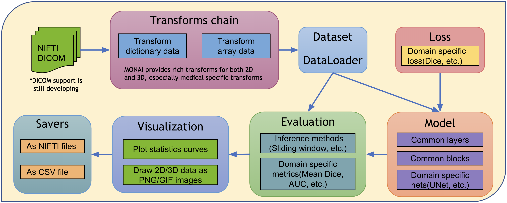
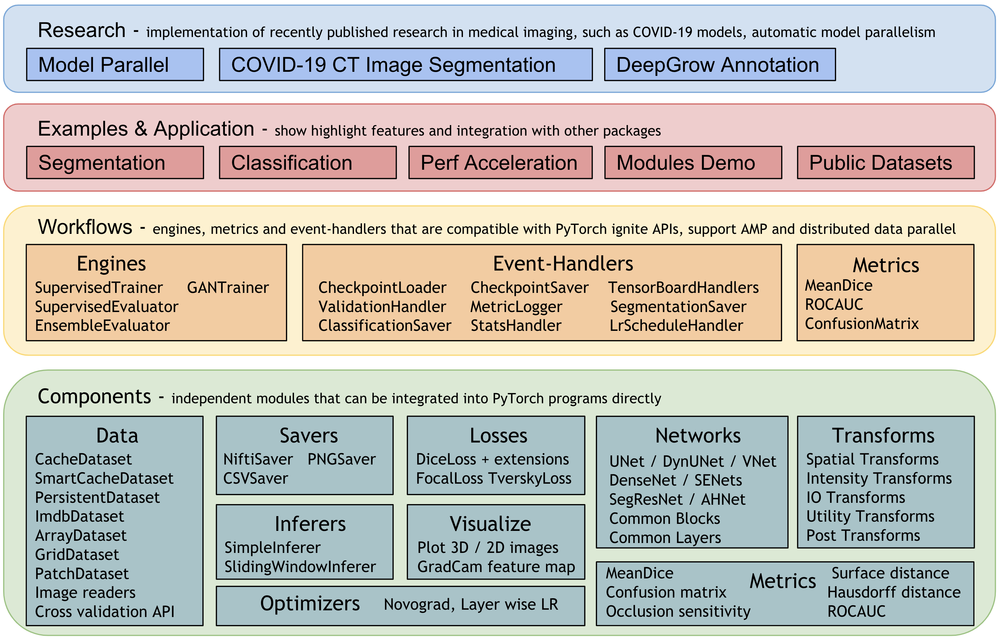
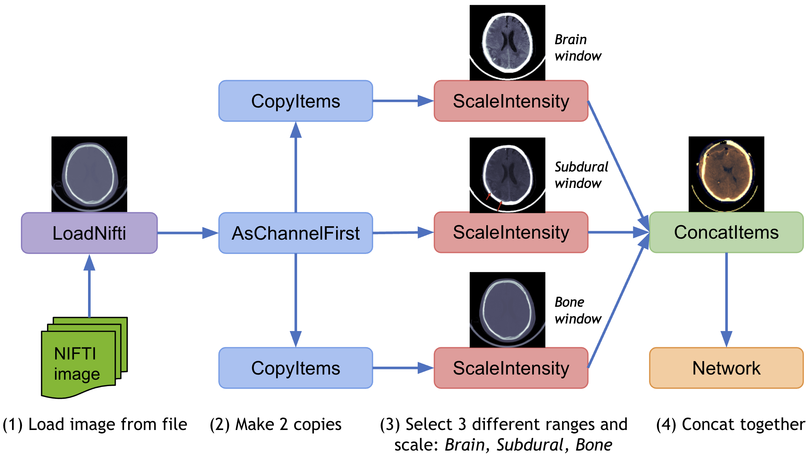
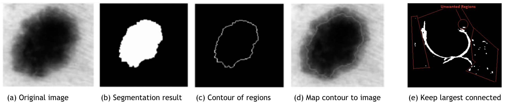
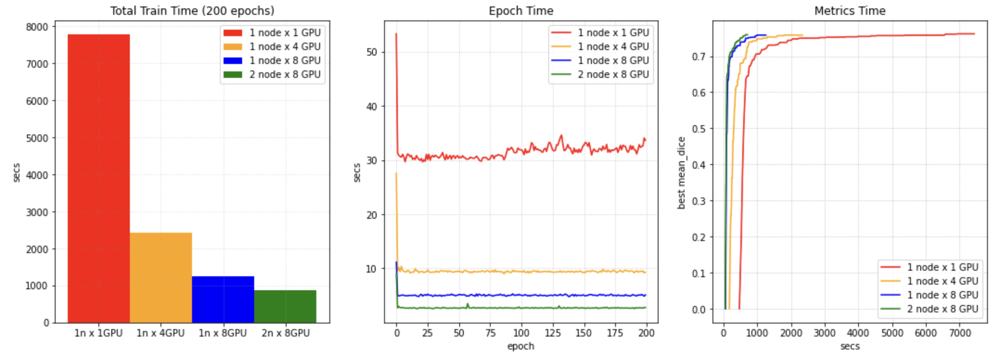

# Modules overview

MONAI aims at supporting deep learning in medical image analysis at multiple granularities.
This figure shows a typical example of the end-to-end workflow in medical deep learning area:


## MONAI architecture
The design principle of MONAI is to provide flexible and light APIs for users with varying expertise.
1. All the core components are independent modules, which can be easily integrated into any existing PyTorch programs.
2. Users can leverage the workflows in MONAI to quickly set up a robust training or evaluation program for research experiments.
3. Rich examples and demos are provided to demonstrate the key features.
4. Researchers contribute implementations based on the state-of-the-art for the latest research challenges, including COVID-19 image analysis, Model Parallel, etc.

The overall architecture and modules are shown in the following figure:

The rest of this page provides more details for each module.

* [Data I/O, processing and augmentation](#medical-image-data-i-o-processing-and-augmentation)
* [Datasets](#datasets)
* [Loss functions](#losses)
* [Optimizers](#optimizers)
* [Network architectures](#network-architectures)
* [Evaluation](#evaluation)
* [Visualization](#visualization)
* [Result writing](#result-writing)
* [Workflows](#workflows)
* [Research](#research)
* [GPU acceleration](#gpu-acceleration)
* [Applications](#applications)

## Medical image data I/O, processing and augmentation
Medical images require highly specialized methods for I/O, preprocessing, and augmentation. Medical images are often in specialized formats with rich meta-information, and the data volumes are often high-dimensional. These require carefully designed manipulation procedures. The medical imaging focus of MONAI is enabled by powerful and flexible image transformations that facilitate user-friendly, reproducible, optimized medical data pre-processing pipelines.

### 1. Transforms support both Dictionary and Array format data
- The widely used computer vision packages (such as ``torchvision``) focus on spatially 2D array image processing. MONAI provides more domain-specific transformations for both spatially 2D and 3D and retains the flexible transformation "compose" feature.
- As medical image preprocessing often requires additional fine-grained system parameters, MONAI provides transforms for input data encapsulated in python dictionaries. Users can specify the keys corresponding to the expected data fields and system parameters to compose complex transformations.

There is a rich set of transforms in six categories: Crop & Pad, Intensity, IO, Post-processing, Spatial, and Utilities. For more details, please visit [all the transforms in MONAI](https://docs.monai.io/en/latest/transforms.html).

### 2. Medical specific transforms
MONAI aims at providing a comprehensive medical image specific
transformations. These currently include, for example:
- `LoadImage`:  Load medical specific formats file from provided path
- `Spacing`:  Resample input image into the specified `pixdim`
- `Orientation`: Change the image's orientation into the specified `axcodes`
- `RandGaussianNoise`: Perturb image intensities by adding statistical noises
- `NormalizeIntensity`: Intensity Normalization based on mean and standard deviation
- `Affine`: Transform image based on the affine parameters
- `Rand2DElastic`: Random elastic deformation and affine in 2D
- `Rand3DElastic`: Random elastic deformation and affine in 3D

[2D transforms tutorial](https://github.com/Project-MONAI/tutorials/blob/master/modules/transforms_demo_2d.ipynb) shows the detailed usage of several MONAI medical image specific transforms.


### 3. Fused spatial transforms and GPU acceleration
As medical image volumes are usually large (in multi-dimensional arrays), pre-processing performance affects the overall pipeline speed. MONAI provides affine transforms to execute fused spatial operations, supports GPU acceleration via native PyTorch for high performance.

For example:
```py
# create an Affine transform
affine = Affine(
    rotate_params=np.pi/4,
    scale_params=(1.2, 1.2),
    translate_params=(200, 40),
    padding_mode='zeros',
    device=torch.device('cuda:0')
)
# convert the image using bilinear interpolation
new_img = affine(image, spatial_size=(300, 400), mode='bilinear')
```
Experiments and test results are available at [Fused transforms test](https://github.com/Project-MONAI/tutorials/blob/master/acceleration/transform_speed.ipynb).

Currently all the geometric image transforms (Spacing, Zoom, Rotate, Resize, etc.) are designed based on the PyTorch native interfaces. [Geometric transforms tutorial](https://github.com/Project-MONAI/tutorials/blob/master/modules/3d_image_transforms.ipynb) indicates the usage of affine transforms with 3D medical images.


### 4. Randomly crop out batch images based on positive/negative ratio
Medical image data volume may be too large to fit into GPU memory. A widely-used approach is to randomly draw small size data samples during training and run a “sliding window” routine for inference.  MONAI currently provides general random sampling strategies including class-balanced fixed ratio sampling which may help stabilize the patch-based training process. A typical example is in [Spleen 3D segmentation tutorial](https://github.com/Project-MONAI/tutorials/blob/master/3d_segmentation/spleen_segmentation_3d.ipynb), which achieves the class-balanced sampling with `RandCropByPosNegLabel` transform.

### 5. Deterministic training for reproducibility
Deterministic training support is necessary and important for deep learning research, especially in the medical field. Users can easily set the random seed to all the random transforms in MONAI locally and will not affect other non-deterministic modules in the user's program.

For example:
```py
# define a transform chain for pre-processing
train_transforms = monai.transforms.Compose([
    LoadImaged(keys=['image', 'label']),
    RandRotate90d(keys=['image', 'label'], prob=0.2, spatial_axes=[0, 2]),
    ... ...
])
# set determinism for reproducibility
train_transforms.set_random_state(seed=0)
```
Users can also enable/disable deterministic at the beginning of training program:
```py
monai.utils.set_determinism(seed=0, additional_settings=None)
```

### 6. Multiple transform chains
To apply different transforms on the same data and concatenate the results, MONAI provides `CopyItems` transform to make copies of specified items in the data dictionary and `ConcatItems` transform to combine specified items on the expected dimension, and also provides `DeleteItems` transform to delete unnecessary items to save memory.

Typical usage is to scale the intensity of the same image into different ranges and concatenate the results together.


### 7. Debug transforms with DataStats
When transforms are combined with the "compose" function, it's not easy to track the output of specific transform. To help debug errors in the composed transforms, MONAI provides utility transforms such as `DataStats` to print out intermediate data properties such as `data shape`, `value range`, `data value`, `Additional information`, etc. It's a self-contained transform and can be integrated into any transform chain.

### 8. Post-processing transforms for model output
MONAI also provides post-processing transforms for handling the model outputs. Currently, the transforms include:
- Adding activation layer (Sigmoid, Softmax, etc.).
- Converting to discrete values (Argmax, One-Hot, Threshold value, etc), as below figure (b).
- Splitting multi-channel data into multiple single channels.
- Removing segmentation noise based on Connected Component Analysis, as below figure (c).
- Extracting contour of segmentation result, which can be used to map to original image and evaluate the model, as below figure (d) and (e).

After applying the post-processing transforms, it's easier to compute metrics, save model output into files or visualize data in the TensorBoard. [Post transforms tutorial](https://github.com/Project-MONAI/tutorials/blob/master/modules/post_transforms.ipynb) shows an example with several main post transforms.


### 9. Integrate third-party transforms
The design of MONAI transforms emphasis code readability and usability. It works for array data or dictionary-based data. MONAI also provides `Adaptor` tools to accommodate different data format for 3rd party transforms. To convert the data shapes or types, utility transforms such as `ToTensor`, `ToNumpy`, `SqueezeDim` are also provided. So it's easy to enhance the transform chain by seamlessly integrating transforms from external packages, including: `ITK`, `BatchGenerator`, `TorchIO` and `Rising`.

For more details, please check out the tutorial: [integrate 3rd party transforms into MONAI program](https://github.com/Project-MONAI/tutorials/blob/master/modules/integrate_3rd_party_transforms.ipynb).

### 10. IO factory for medical image formats
Many popular image formats exist in the medical domain, and they are quite different with rich metadata information. To easily handle different medical image formats in the same pipeline, [MONAI provides `LoadImage` transform](https://github.com/Project-MONAI/tutorials/blob/master/modules/load_medical_images.ipynb), which can automatically choose image readers based on the supported suffixes and in below priority order:
- User-specified reader at runtime when calling this loader.
- Registered readers from the latest to the first in the list.
- Default readers: (nii, nii.gz -> NibabelReader), (png, jpg, bmp -> PILReader), (npz, npy -> NumpyReader), (others -> ITKReader).

The `ImageReader` API is quite straightforward, users can easily extend it for their own customized image readers.

With these pre-defined image readers, MONAI can load images in formats: `NIfTI`, `DICOM`, `PNG`, `JPG`, `BMP`, `NPY/NPZ`, etc.

### 11. Save transform data into NIfTI or PNG files
To convert images into files or debug the transform chain, MONAI provides `SaveImage` transform. Users can inject this transform into the transform chain to save the results.

### 12. Automatically ensure `channel-first` data shape
Medical images have different shape formats. They can be `channel-last`, `channel-first` or even `no-channel`. We may, for example, want to load several `no-channel` images and stack them as `channel-first` data. To improve the user experience, MONAI provided an `EnsureChannelFirst` transform to automatically detect data shape according to the meta information and convert it to the `channel-first` format consistently.

### 13. Invert spatial transforms and test-time augmentations
It is often desirable to invert the previously applied spatial transforms (resize, flip, rotate, zoom, crop, pad, etc.) with the deep learning workflows, for example, to resume to the original imaging space after processing the image data in a normalized data space.  We enhance almost all the spatial transforms with an `inverse` operation and release this experimental feature in v0.5.0. Users can easily invert all the spatial transforms for one transformed data item or a batch of data items. It also can be achieved within the workflows by using the `TransformInverter` handler.

If the pipeline includes random transformations, users may want to observe the effect that these transformations have on the output. The typical approach is that we pass the same input through the transforms multiple times with different random realizations. Then use the inverse transforms to move all the results to a common space, and calculate the metrics. MONAI provided `TestTimeAugmentation` for this feature, which by default will calculate the `mode`, `mean`, `standard deviation` and `volume variation coefficient`.

[Invert transforms and TTA tutorials](https://github.com/Project-MONAI/tutorials/blob/master/modules/inverse_transforms_and_test_time_augmentations.ipynb) introduce details about the API with usage examples.

(1) The last column is the inverted data of model output:


(2) The TTA results of `mode`, `mean` and `standard deviation`:


## Datasets
### 1. Cache IO and transforms data to accelerate training
Users often need to train the model with many (potentially thousands of) epochs over the data to achieve the desired model quality. A native PyTorch implementation may repeatedly load data and run the same preprocessing steps for every epoch during training, which can be time-consuming and unnecessary, especially when the medical image volumes are large.

MONAI provides a multi-threads `CacheDataset` and `LMDBDataset` to accelerate these transformation steps during training by storing the intermediate outcomes before the first randomized transform in the transform chain. Enabling this feature could potentially give 10x training speedups in the [Datasets experiment](https://github.com/Project-MONAI/tutorials/blob/master/acceleration/dataset_type_performance.ipynb).


### 2. Cache intermediate outcomes into persistent storage
The `PersistentDataset` is similar to the CacheDataset, where the intermediate cache values are persisted to disk storage or LMDB for rapid retrieval between experimental runs (as is the case when tuning hyperparameters), or when the entire data set size exceeds available memory. The `PersistentDataset` could achieve similar performance when comparing to `CacheDataset` in [Datasets experiment](https://github.com/Project-MONAI/tutorials/blob/master/acceleration/dataset_type_performance.ipynb).


### 3. SmartCache mechanism for big datasets
During training with very big volume dataset, an efficient approach is to only train with a subset of the dataset in an epoch and dynamically replace part of the subset in every epoch. It's the `SmartCache` mechanism in [NVIDIA Clara-train SDK](https://docs.nvidia.com/clara/tlt-mi/clara-train-sdk-v3.0/nvmidl/additional_features/smart_cache.html#smart-cache).

MONAI provides a PyTorch version `SmartCache` as `SmartCacheDataset`. In each epoch, only the items in the cache are used for training, at the same time, another thread is preparing replacement items by applying the transform sequence to items not in the cache. Once one epoch is completed, `SmartCache` replaces the same number of items with replacement items.

For example, if we have 5 images: `[image1, image2, image3, image4, image5]`, and `cache_num=4`, `replace_rate=0.25`. So the actual training images cached and replaced for every epoch are as below:
```
epoch 1: [image1, image2, image3, image4]
epoch 2: [image2, image3, image4, image5]
epoch 3: [image3, image4, image5, image1]
epoch 3: [image4, image5, image1, image2]
epoch N: [image[N % 5] ...]
```
Full example of `SmartCacheDataset` is available at [Distributed training with SmartCache](https://github.com/Project-MONAI/tutorials/blob/master/acceleration/distributed_training/unet_training_smartcache.py).

### 4. Zip multiple PyTorch datasets and fuse the output
MONAI provides `ZipDataset` to associate multiple PyTorch datasets and combine the output data (with the same corresponding batch index) into a tuple, which can be helpful to execute complex training processes based on various data sources.

For example:
```py
class DatasetA(Dataset):
    def __getitem__(self, index: int):
        return image_data[index]

class DatasetB(Dataset):
    def __getitem__(self, index: int):
        return extra_data[index]

dataset = ZipDataset([DatasetA(), DatasetB()], transform)
```

### 5. PatchDataset
`monai.data.PatchDataset` provides a flexible API to combine both image- and patch-level preprocessing:
```python
image_dataset = Dataset(input_images, transforms=image_transforms)
patch_dataset = PatchDataset(
    dataset=image_dataset, patch_func=sampler,
    samples_per_image=n_samples, transform=patch_transforms)
```
It supports user-specified `image_transforms` and `patch_transforms` with customisable patch sampling strategies,
which decouples the two-level computations in a multiprocess context.

### 6. Predefined Datasets for public medical data
To quickly get started with popular training data in the medical domain, MONAI provides several data-specific Datasets(like: `MedNISTDataset`, `DecathlonDataset`, etc.), which include downloading from our AWS storage, extracting data files and support generation of training/evaluation items with transforms. And they are flexible that users can easily modify the JSON config file to change the default behaviors.

MONAI always welcome new contributions of public datasets, please refer to existing Datasets and leverage the download and extracting APIs, etc. [Public datasets tutorial](https://github.com/Project-MONAI/tutorials/blob/master/modules/public_datasets.ipynb) indicates how to quickly set up training workflows with `MedNISTDataset` and `DecathlonDataset` and how to create a new `Dataset` for public data.

The common workflow of predefined datasets:


### 7. Partition dataset for cross validation
The `partition_dataset` utility in MONAI can perform several kinds of mechanism to partition dataset for training and validation or cross-validation. It supports shuffling based on a specified random seed, and will return a set of datasets, each dataset contains one partition. And it can split the dataset based on specified ratios or evenly split into `num_partitions`. For given class labels, it can also make sure the same ratio of classes in every partition.

## Losses
There are domain-specific loss functions in the medical imaging research which are not typically used in the generic computer vision tasks. As an important module of MONAI, these loss functions are implemented in PyTorch, such as `DiceLoss`, `GeneralizedDiceLoss`, `MaskedDiceLoss`, `TverskyLoss`, `FocalLoss`, `DiceCELoss`, and `DiceFocalLoss`, etc.

## Optimizers
MONAI provides several advanced features in optimizers to help accelerate the training or fine-tuning progress. For example, `Novograd` optimizer can be used to converge obviously faster than traditional optimizers. And users can easily define different learning rates for the model layers based [on the `generate_param_groups` utility API](https://github.com/Project-MONAI/tutorials/blob/master/modules/layer_wise_learning_rate.ipynb).

Another important feature is `LearningRateFinder`. The learning rate range test increases the learning rate in a pre-training run between two boundaries in a linear or exponential manner. It provides valuable information on how well the network can be trained over a range of learning rates and what the optimal learning rates are. [LearningRateFinder tutorial](https://github.com/Project-MONAI/tutorials/blob/master/modules/learning_rate.ipynb) indicates the API usage examples.


## Network architectures
Some deep neural network architectures have shown to be particularly effective for medical imaging analysis tasks. MONAI implements reference networks with the aims of both flexibility and code readability.

### 1. Predefined layers and blocks
To leverage the common network layers and blocks, MONAI provides several predefined layers and blocks which are compatible with 1D, 2D and 3D networks. Users can easily integrate the layer factories in their own networks.

For example:
```py
# import MONAI’s layer factory
from monai.networks.layers import Conv

# adds a transposed convolution layer to the network
# which is compatible with different spatial dimensions.
name, dimension = Conv.CONVTRANS, 3
conv_type = Conv[name, dimension]
add_module('conv1', conv_type(in_channels, out_channels, kernel_size=1, bias=False))
```

### 2. Implementation of generic 2D/3D networks
And there are several 1D/2D/3D-compatible implementations of intermediate blocks and generic networks, such as UNet, DynUNet, DenseNet, GAN, AHNet, VNet, SENet(and SEResNet, SEResNeXt), SegResNet, etc. All the networks can support PyTorch serialization pipeline based on `torch.jit.script`.

## Evaluation
To run model inferences and evaluate the model quality, MONAI provides reference implementations for the relevant widely-used approaches. Currently, several popular evaluation metrics and inference patterns are included:

### 1. Sliding window inference
For model inferences on large volumes, the sliding window approach is a popular choice to achieve high performance while having flexible memory requirements (_alternatively, please check out the latest research on [model parallel training](#lamp-large-deep-nets-with-automated-model-parallelism-for-image-segmentation) using MONAI_). It also supports `overlap` and `blending_mode` configurations to handle the overlapped windows for better performances.

A typical process is:
1. Select continuous windows on the original image.
2. Iteratively run batched window inferences until all windows are analyzed.
3. Aggregate the inference outputs to a single segmentation map.
4. Save the results to file or compute some evaluation metrics.


The [Spleen 3D segmentation tutorial](https://github.com/Project-MONAI/tutorials/blob/master/3d_segmentation/spleen_segmentation_3d.ipynb) leverages `SlidingWindow` inference for validation.

### 2. Metrics for medical tasks
Various useful evaluation metrics have been used to measure the quality of medical image specific models. MONAI already implemented many medical domain-specific metrics, such as: `Mean Dice`, `ROCAUC`, `Confusion Matrices`, `Hausdorff Distance`, `Surface Distance`, `Occlusion Sensitivity`.

For example, `Mean Dice` score can be used for segmentation tasks, and the area under the ROC curve(`ROCAUC`) for classification tasks. We continue to integrate more options.

### 3. Metrics report generation
During evaluation, users usually save the metrics of every input image, then analyze the bad cases to improve the deep learning pipeline. To save detailed information of metrics, MONAI provided a handler `MetricsSaver`, which can save the final metric values, raw metric of every model output channel of every input image, metrics summary report of operations: `mean`, `median`, `max`, `min`, `90percentile`, `std`, etc. The `MeanDice` reports of validation with prostate dataset are as below:


## Visualization
Beyond the simple point and curve plotting, MONAI provides intuitive interfaces to visualize multidimensional data as GIF animations in TensorBoard. This could provide a quick qualitative assessment of the model by visualizing, for example, the volumetric inputs, segmentation maps, and intermediate feature maps. A runnable example with visualization is available at [UNet training example](https://github.com/Project-MONAI/tutorials/blob/master/3d_segmentation/torch/unet_training_dict.py).

And to visualize the class activation mapping for a trained classification model, MONAI provides CAM, GradCAM, GradCAM++ APIs for both 2D and 3D models:


The above example is generated by computing [GradCAM/GradCAM++ from a lung CT lesion classification model](https://github.com/Project-MONAI/tutorials/tree/master/modules/interpretability).

## Result writing
Currently, MONAI supports writing the model outputs as NIfTI files or PNG files for segmentation tasks, and as CSV files for classification tasks. And the writers can restore the data spacing, orientation or shape according to the `original_shape` or `original_affine` information from the input image.

A rich set of formats will be supported soon, along with relevant statistics and evaluation metrics automatically computed from the outputs.

## Workflows
To quickly set up training and evaluation experiments, MONAI provides a set of workflows to significantly simplify the modules and allow for fast prototyping.

These features decouple the domain-specific components and the generic machine learning processes. They also provide a set of unify APIs for higher level applications (such as AutoML, Federated Learning).
The trainers and evaluators of the workflows are compatible with pytorch-ignite `Engine` and `Event-Handler` mechanism. There are rich event handlers in MONAI to independently attach to the trainer or evaluator, and users can register additional `custom events` to workflows.

### 1. General workflows pipeline
The workflow and some of MONAI event handlers are shown as below:


The end-to-end training and evaluation examples are available at [Workflow examples](https://github.com/Project-MONAI/tutorials/tree/master/modules/engines).

### 2. EnsembleEvaluator
Models ensemble is a popular strategy in machine learning and deep learning areas to achieve more accurate and more stable outputs. A typical practice is:
1. Split all the training dataset into K folds.
2. Train K models with every K-1 folds data.
3. Execute inference on the test data with all the K models.
4. Compute the average values with weights or vote the most common value as the final result.


More details of practice is at [Model ensemble tutorial](https://github.com/Project-MONAI/tutorials/blob/master/modules/models_ensemble.ipynb).

### 3. Transfer learning for different input / output classes
`Transfer-learning` is a very common and efficient training approach, especially in the medical-specific domain where obtaining large datasets for training can be difficult. So transfer-learning from a pre-trained checkpoint can significantly improve the model metrics and shorten training time.

MONAI provided `CheckpointLoader` to load a checkpoint for the workflow before training, and it allows some `layer names` of the current network don't match the checkpoint, or some `layer shapes` don't match the checkpoint, which can be useful if the current task has different input image classes or output classes.

## Research
There are several research prototypes in MONAI corresponding to the recently published papers that address advanced research problems.
We always welcome contributions in forms of comments, suggestions, and code implementations.

The generic patterns/modules identified from the research prototypes will be integrated into MONAI core functionality.

### 1. COPLE-Net for COVID-19 Pneumonia Lesion Segmentation
[A reimplementation](https://monai.io/research/coplenet-pneumonia-lesion-segmentation) of the COPLE-Net originally proposed by:

G. Wang, X. Liu, C. Li, Z. Xu, J. Ruan, H. Zhu, T. Meng, K. Li, N. Huang, S. Zhang. (2020) "A Noise-robust Framework for Automatic Segmentation of COVID-19 Pneumonia Lesions from CT Images." IEEE Transactions on Medical Imaging. 2020. [DOI: 10.1109/TMI.2020.3000314](https://doi.org/10.1109/TMI.2020.3000314)


### 2. LAMP: Large Deep Nets with Automated Model Parallelism for Image Segmentation
[A reimplementation](https://monai.io/research/lamp-automated-model-parallelism) of the LAMP system originally proposed by:

Wentao Zhu, Can Zhao, Wenqi Li, Holger Roth, Ziyue Xu, and Daguang Xu (2020) "LAMP: Large Deep Nets with Automated Model Parallelism for Image Segmentation." MICCAI 2020 (Early Accept, paper link: https://arxiv.org/abs/2006.12575)


## GPU acceleration
NVIDIA GPUs have been widely applied in many areas of deep learning training and evaluation, and the CUDA parallel computation shows obvious acceleration when comparing to traditional computation methods. To fully leverage GPU features, many popular mechanisms raised, like automatic mixed precision (AMP), distributed data parallel, etc. MONAI can support these features and provides rich examples.

### 1. Auto mixed precision(AMP)
In 2017, NVIDIA researchers developed a methodology for mixed-precision training, which combined single-precision (FP32) with half-precision (e.g. FP16) format when training a network, and it achieved the same accuracy as FP32 training using the same hyperparameters.

For the PyTorch 1.6 release, developers at NVIDIA and Facebook moved mixed precision functionality into PyTorch core as the AMP package, `torch.cuda.amp`.

MONAI workflows can easily set `amp=True/False` in `SupervisedTrainer` or `SupervisedEvaluator` during training or evaluation to enable/disable AMP. And we tried to compare the training speed if AMP ON/OFF on NVIDIA V100 GPU with CUDA 11 and PyTorch 1.6, got some benchmark for reference:

We also executed the same test program on NVIDIA A100 GPU with the same software environment, got much faster benchmark for reference:

More details is available at [AMP training tutorial](https://github.com/Project-MONAI/tutorials/blob/master/acceleration/automatic_mixed_precision.ipynb).
We also tried to combine AMP with `CacheDataset` and `Novograd` optimizer to achieve the fast training in MONAI, able to obtain approximately 12x speedup compared with a Pytorch native implementation when the training converges at a validation mean dice of 0.93. Benchmark for reference:

More details is available at [Fast training tutorial](https://github.com/Project-MONAI/tutorials/blob/master/acceleration/fast_training_tutorial.ipynb).

### 2. Distributed data parallel
Distributed data parallel is an important feature of PyTorch to connect multiple GPU devices on single or multiple nodes to train or evaluate models. MONAI provides demos for reference: train/evaluate with PyTorch DDP, train/evaluate with Horovod, train/evaluate with Ignite DDP, partition dataset and train with SmartCacheDataset, as well as a real world training example based on Decathlon challenge Task01 - Brain Tumor segmentation.
The demo contains distributed caching, training, and validation. We tried to train this example on NVIDIA NGC server, got some performance benchmarks for reference(PyTorch 1.6, CUDA 11, NVIDIA V100 GPUs):



### 3. C++/CUDA optimized modules
To accelerate some heavy computation progress, C++/CUDA implementation can be an impressive method, which usually brings even hundreds of times faster performance. MONAI contains some C++/CUDA optimized modules, like `Resampler`, `Conditional random field (CRF)`, `Fast bilateral filtering using the permutohedral lattice`, and fully support C++/CUDA programs in CI/CD and building package.

## Applications
The research area of medical image deep learning is expanding fast. To apply the latest achievements into applications, MONAI contains many application components to build end-to-end solutions or prototypes for other similar use cases.

### 1. DeepGrow modules for interactive segmentation
[A reimplementation](https://github.com/Project-MONAI/MONAI/tree/master/monai/apps/deepgrow) of the DeepGrow components, which is deep learning based semi-automated segmentation approach that aims to be a "smart" interactive tool for region of interest delineation in medical images, originally proposed by:

Sakinis, Tomas, et al. "Interactive segmentation of medical images through fully convolutional neural networks." arXiv preprint arXiv:1903.08205 (2019).


### 2. Lesion detection in digital pathology
[Implementation](https://github.com/Project-MONAI/MONAI/tree/master/monai/apps/pathology) of the pathology detection components, which includes efficient whole slide imaging IO and sampling with NVIDIA cuCIM library and SmartCache mechanism, FROC measurements for lesion and probabilistic post-processing for lesion detection.


### 3. Learning-based image registration
Starting from v0.5.0, MONAI provides experimental features for building learning-based 2D/3D registration workflows.  These include image similarity measures as loss functions, bending energy as model regularization, network architectures, warping modules. The components can be used to build the major unsupervised and weakly-supervised algorithms.

The following figure shows the registration of CT images acquired at different time points for a single patient using MONAI:


