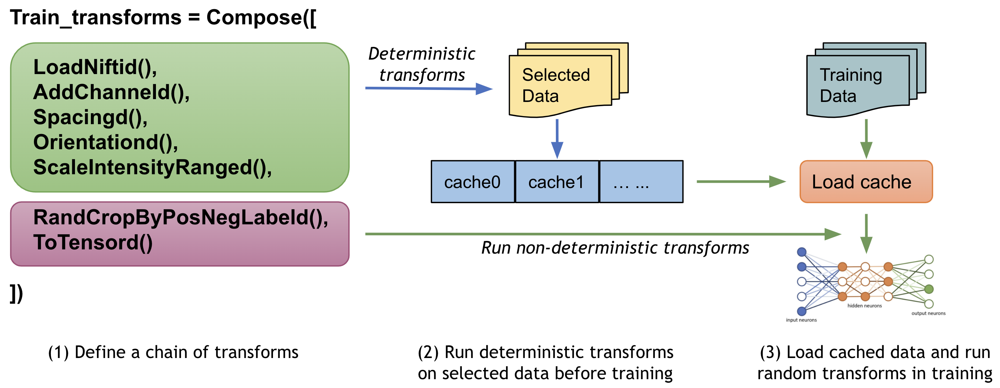

# Modules Overview

MONAI aims at facilitating deep learning in medical image analysis at multiple granularity. This document provides an
overview of the modules and highlights the key capabilities.

The core codebase is designed as a library of lightweight, flexible, and comprehensive APIs for users with varying expertise.
The building blocks are made easy to understand and use, they are carefully decoupled, and can be readily integrated
into existing PyTorch programs and larger systems. By leveraging the workflow and bundle APIs, users can also quickly
set up efficient and robust model training or evaluation pipelines for various domain-specific applications.

The overall architecture and modules are shown in the following figure:


* [Data I/O, processing and augmentation]
* [Datasets and DataLoader]
* [Loss functions](#losses)
* [Optimizers](#optimizers)
* [Network architectures](#network-architectures)
* [Evaluation](#evaluation)
* [Visualization](#visualization)
* [Result writing](#result-writing)
* [Workflows](#workflows)
* [Federated Learning](#federated-laerning)
* [Bundle](#bundle)
* [Research](#research)
* [Performance optimization and GPU acceleration](#performance-optimization-and-gpu-acceleration)
* [Applications](#applications)

## Medical image data I/O, processing and augmentation
Medical images require specialized methods for I/O, preprocessing and augmentation. They often follow specific formats,
are handled with specific protocols, and the data arrays are often high-dimensional.
[`monai.transforms`](https://github.com/Project-MONAI/MONAI/tree/dev/monai/transforms) and
[`monai.data`](https://github.com/Project-MONAI/MONAI/tree/dev/monai/data) modules include a set of domain-specific APIs
for various deep learning applications:

- *Transforms with input data structures in 'array' and 'dictionary' styles*


This enables basic image transformations, as well as more complex preprocessing pipelines such as synchronized operations
across different modalities and model supervision inputs. [[array and dict examples]](https://github.com/Project-MONAI/tutorials/tree/main/3d_segmentation/torch)

- *Various image patch-based sampling mechanism*


Advanced patch sampling methods are implemented for selective preprocessing, such as weighted, class-balanced sampling
from user-specified sampling weight maps.
The output can be in a sequence or iterator pattern which allows for different types of shuffling strategies.

- *Image IO with third-party library integrations*

Several backends are built-in and can support various formats. It is easily extensible for customized format readers.

- *`monai.data.MetaTensor`*

Core data structure combines PyTorch native Tensor APIs with metadata handling,
so that the deep learning models and pipelines can readily incorporate the meta information. [[MetaTensor]](https://colab.research.google.com/drive/1T4iAys-cC2qL80oJkIbAXAPlWNPwp4H7)

- *GPU-based accelerations*

Implementations are provided to ensure optimal usage of the underlying hardware resources. [[fast training guide]](https://github.com/Project-MONAI/tutorials/blob/main/acceleration/fast_model_training_guide.md)

- *Determinism and reproducibility*

They can be achieved with fine-level of local controls via the `Randomizable` API as well as globally
using `set_determinism`.

- *Decollating and invertible transforms*


The mini-batch data output from a model can be decollated, post-processed independently, including inverting
the outputs to an earlier step of the preprocessing according to the tracked metadata and applied operations.

- *Enhanced usability*

Additionally, utilities such as `DataStats` transform, `dev_collate`, and [visualization
methods](https://github.com/Project-MONAI/tutorials/blob/main/modules/transform_visualization.ipynb) are provided as
extensions to PyTorch for improved overall debugability.

## Datasets and Data Loading


### 1. Cache IO and transforms data to accelerate training
Users often need to train the model with many (potentially thousands of) epochs over the data to achieve the desired model quality. A native PyTorch implementation may repeatedly load data and run the same preprocessing steps for every epoch during training, which can be time-consuming and unnecessary, especially when the medical image volumes are large.

MONAI provides a multi-thread `CacheDataset` and `LMDBDataset` to accelerate these transformation steps during training by storing the intermediate outcomes before the first randomized transform in the transform chain. Enabling this feature could potentially give 10x training speedups in the [Datasets experiment](https://github.com/Project-MONAI/tutorials/blob/master/acceleration/dataset_type_performance.ipynb).



### 2. Cache intermediate outcomes into persistent storage
The `PersistentDataset` is similar to the CacheDataset, where the intermediate cache values are persisted to disk storage or LMDB for rapid retrieval between experimental runs (as is the case when tuning hyperparameters), or when the entire data set size exceeds available memory. The `PersistentDataset` could achieve similar performance when comparing to `CacheDataset` in [Datasets experiment](https://github.com/Project-MONAI/tutorials/blob/master/acceleration/dataset_type_performance.ipynb).


### 3. SmartCache mechanism for big datasets
During training with large volume dataset, an efficient approach is to only train with a subset of the dataset in an epoch and dynamically replace part of the subset in every epoch. It's the `SmartCache` mechanism in [NVIDIA Clara-train SDK](https://docs.nvidia.com/clara/tlt-mi/clara-train-sdk-v3.0/nvmidl/additional_features/smart_cache.html#smart-cache).

MONAI provides a PyTorch version `SmartCache` as `SmartCacheDataset`. In each epoch, only the items in the cache are used for training, at the same time, another thread is preparing replacement items by applying the transform sequence to items not in the cache. Once one epoch is completed, `SmartCache` replaces the same number of items with replacement items.

For example, if we have 5 images: `[image1, image2, image3, image4, image5]`, and `cache_num=4`, `replace_rate=0.25`. So the actual training images cached and replaced for every epoch are as below:
```
epoch 1: [image1, image2, image3, image4]
epoch 2: [image2, image3, image4, image5]
epoch 3: [image3, image4, image5, image1]
epoch 3: [image4, image5, image1, image2]
epoch N: [image[N % 5] ...]
```
Full example of `SmartCacheDataset` is available at [Distributed training with SmartCache](https://github.com/Project-MONAI/tutorials/blob/master/acceleration/distributed_training/unet_training_smartcache.py).

### 4. Zip multiple PyTorch datasets and fuse the output
MONAI provides `ZipDataset` to associate multiple PyTorch datasets and combine the output data (with the same corresponding batch index) into a tuple, which can be helpful to execute complex training processes based on various data sources.

For example:
```py
class DatasetA(Dataset):
    def __getitem__(self, index: int):
        return image_data[index]

class DatasetB(Dataset):
    def __getitem__(self, index: int):
        return extra_data[index]

dataset = ZipDataset([DatasetA(), DatasetB()], transform)
```

### 5. PatchDataset
`monai.data.PatchDataset` provides a flexible API to combine both image- and patch-level preprocessing:
```python
image_dataset = Dataset(input_images, transforms=image_transforms)
patch_dataset = PatchDataset(
    dataset=image_dataset, patch_func=sampler,
    samples_per_image=n_samples, transform=patch_transforms)
```
It supports user-specified `image_transforms` and `patch_transforms` with customisable patch sampling strategies,
which decouples the two-level computations in a multiprocess context.

### 6. Predefined Datasets for public medical data
To quickly get started with popular training data in the medical domain, MONAI provides several data-specific Datasets(like: `MedNISTDataset`, `DecathlonDataset`, etc.), which include downloading from our AWS storage, extracting data files and support generation of training/evaluation items with transforms. And they are flexible in that users can easily modify the JSON config file to change the default behaviors.

MONAI always welcome new contributions of public datasets, please refer to existing Datasets and leverage the download and extracting APIs, etc. [Public datasets tutorial](https://github.com/Project-MONAI/tutorials/blob/master/modules/public_datasets.ipynb) indicates how to quickly set up training workflows with `MedNISTDataset` and `DecathlonDataset` and how to create a new `Dataset` for public data.

The common workflow of predefined datasets:


### 7. Partition dataset for cross validation
The `partition_dataset` utility in MONAI can perform different types of partitioning for training and validation or cross-validation. It supports shuffling based on a specified random seed, and will return a set of datasets, each dataset contains one partition. And it can split the dataset based on specified ratios or evenly split into `num_partitions`. For given class labels, it can also make sure the same ratio of classes in every partition.

### 8. CSV `Dataset` and `IterableDataset`
CSV tables are often used in additional to image data to incorporate adjunct information, such as patient demographics, lab results, image acquisition parameters and other non-image data, MONAI provides `CSVDataset` to load CSV files and `CSVIterableDataset` to load large CSV files with scalable data access.
In addition to the regular preprocessing transform while loading, it also supports multiple CSV files loading, joining tables, rows and columns selection and grouping. [CSVDatasets tutorial](https://github.com/Project-MONAI/tutorials/blob/master/modules/csv_datasets.ipynb) shows detailed usage examples.

### 9. `ThreadDataLoader` vs. `DataLoader`
If the transforms are light-weighted, especially when we cache all the data in RAM, the multiprocessing of PyTorch `DataLoader` may cause unnecessary IPC time and cause the drop of GPU utilization after every epoch. MONAI provides `ThreadDataLoader` which executes the transforms in a separate thread:


a `ThreadDataLoader` example is available at [Spleen fast training tutorial](https://github.com/Project-MONAI/tutorials/blob/master/acceleration/fast_training_tutorial.ipynb).

## Losses
There are domain-specific loss functions in the medical imaging research which are not typically used in generic computer vision tasks. As an important module of MONAI, these loss functions are implemented in PyTorch, such as `DiceLoss`, `GeneralizedDiceLoss`, `MaskedDiceLoss`, `TverskyLoss`, `FocalLoss`, `DiceCELoss`, and `DiceFocalLoss`, etc.

## Optimizers
MONAI provides several advanced features in optimizers to help accelerate the training or fine-tuning progress. For example, `Novograd` optimizer can be used to converge faster than the traditional optimizers. And users can easily define different learning rates for the model layers based [on the `generate_param_groups` utility API](https://github.com/Project-MONAI/tutorials/blob/master/modules/layer_wise_learning_rate.ipynb).

Another important feature is `LearningRateFinder`. The learning rate range test increases the learning rate in a pre-training run between two boundaries in a linear or exponential manner. It provides valuable information on how well the network can be trained over a range of learning rates and what the optimal learning rates are. [LearningRateFinder tutorial](https://github.com/Project-MONAI/tutorials/blob/master/modules/learning_rate.ipynb) indicates the API usage examples.


## Network architectures
Some deep neural network architectures have shown to be particularly effective for medical imaging analysis tasks. MONAI implements reference networks with the aims of both flexibility and code readability.

### 1. Predefined layers and blocks
To leverage the common network layers and blocks, MONAI provides several predefined layers and blocks which are compatible with 1D, 2D and 3D networks. Users can easily integrate the layer factories in their customised networks.

For example:
```py
# import MONAI’s layer factory
from monai.networks.layers import Conv

# adds a transposed convolution layer to the network
# which is compatible with different spatial dimensions.
name, dimension = Conv.CONVTRANS, 3
conv_type = Conv[name, dimension]
add_module('conv1', conv_type(in_channels, out_channels, kernel_size=1, bias=False))
```

### 2. Implementation of generic 2D/3D networks
And there are several 1D/2D/3D-compatible implementations of intermediate blocks and generic networks, such as UNet, DynUNet, DenseNet, GAN, AHNet, VNet, SENet(and SEResNet, SEResNeXt), SegResNet, EfficientNet, Attention-based transformer networks, Multi-instance learning networks, DiNTS for AutoML, etc. All the networks can support PyTorch serialization pipeline based on `torch.jit.script`.

### 3. Network adapter to finetune final layers
Instead of training from scratch, we often leverage the existing models, and finetune the final layers of a network for new learning tasks. MONAI provides a `NetAdapter` to easily replace the last layer of a model by a convolutional layer or a fully-connected layer. A typical usage example is to adapt [Torchvision models trained with ImageNet](https://pytorch.org/vision/stable/models.html) for other learning tasks.

## Evaluation
To run model inferences and evaluate the model quality, MONAI provides reference implementations for the relevant widely-used approaches. Currently, several popular evaluation metrics and inference patterns are included:

### 1. Sliding window inference
For model inferences on large volumes, the sliding window approach is a popular choice to achieve high performance while having flexible memory requirements (_alternatively, please check out the latest research on [model parallel training](#lamp-large-deep-nets-with-automated-model-parallelism-for-image-segmentation) using MONAI_). It also supports `overlap` and `blending_mode` configurations to handle the overlapped windows for better performances.

A typical process is:
1. Select continuous windows on the original image.
2. Iteratively run batched window inferences until all windows are analyzed.
3. Aggregate the inference outputs to a single segmentation map.
4. Save the results to file or compute some evaluation metrics.


The [Spleen 3D segmentation tutorial](https://github.com/Project-MONAI/tutorials/blob/master/3d_segmentation/spleen_segmentation_3d.ipynb) leverages `SlidingWindow` inference for validation.

### 2. Metrics for medical tasks
Various useful evaluation metrics have been used to measure the quality of medical image specific models. MONAI already implemented many medical domain-specific metrics, such as: `Mean Dice`, `ROCAUC`, `Confusion Matrices`, `Hausdorff Distance`, `Surface Distance`, `Occlusion Sensitivity`.

For example, `Mean Dice` score can be used for segmentation tasks, and the area under the ROC curve(`ROCAUC`) for classification tasks. We continue to integrate more options.

1. MONAI provides flexible base APIs for metrics
The base classes of MONAI metrics implement the basic computation logic for both iteration and epoch-based metrics. They are a good starting point for customized metrics.
2. All the metrics support data parallel computation
With a `Cumulative` base class, intermediate metric outcomes can be automatically buffered, cumulated, synced across distributed processes, and aggregated for the final results. [Multi-processing computation example](https://github.com/Project-MONAI/tutorials/blob/master/modules/compute_metric.py) shows how to compute metrics based on saved predictions and labels in multi-processing environment.
3. All the metrics modules can handle `batch-first` Tensors and list of `channel-first` Tensors

### 3. Metrics report generation
During evaluation, users usually save the metrics of every input image, then analyze the bad cases to improve the deep learning pipeline. To save detailed information of metrics, MONAI provided a handler `MetricsSaver`, which can save the final metric values, raw metric of every model output channel of every input image, metrics summary report of operations: `mean`, `median`, `max`, `min`, `<int>percentile`, `std`, etc. The `MeanDice` reports of validation with prostate dataset are as below:


## Visualization
Beyond the simple point and curve plotting, MONAI provides intuitive interfaces to visualize multidimensional data as GIF animations in TensorBoard. This could provide a quick qualitative assessment of the model by visualizing, for example, the volumetric inputs, segmentation maps, and intermediate feature maps. A runnable example with visualization is available at [UNet training example](https://github.com/Project-MONAI/tutorials/blob/master/3d_segmentation/torch/unet_training_dict.py). To work with ignite program, MONAI also provides several ignite handlers to visualize training curve and metrics with `TensorBoard` or `MLFlow`, more details is available in [TensorBoard and MLFlow handlers example](https://github.com/Project-MONAI/tutorials/blob/master/3d_segmentation/unet_segmentation_3d_ignite.ipynb).

To easily visualize a 3D image as frames of 2D images, MONAI provides the utility `matshow3d` based on `matplotlib` library. It can plot frames of image for the specified dimension, showing a spleen 3D image as example:
`matshow3d(volume=image, figsize=(100, 100), every_n=10, frame_dim=-1 show=True, cmap="gray")`


MONAI also provides the `blend_images` utility to blend the `image` and `label` to an RGB color image to better visualize the segmentation regions with the specified `cmap` mode and weights, etc. Showing a spleen segmentation `image` and the corresponding `label` as example:


For more details of `TensorBoard utility`, `matshow3d` and `blend_images`, please check the [visualization tutorial](https://github.com/Project-MONAI/tutorials/blob/master/modules/transform_visualization.ipynb).

And to visualize the class activation mapping for a trained classification model, MONAI provides CAM, GradCAM, GradCAM++ APIs for both 2D and 3D models:


The above example is generated by computing [GradCAM/GradCAM++ from a lung CT lesion classification model](https://github.com/Project-MONAI/tutorials/tree/master/modules/interpretability).

## Result writing
Currently, MONAI supports writing the model outputs as NIfTI files or PNG files for segmentation tasks, and as CSV files for classification tasks. And the writers can restore the data spacing, orientation or shape according to the `original_shape` or `original_affine` information from the input image.

MONAI provides `SaveImage` transform to write the data volumes of image or prediction with automatically chose image writers based on the specified suffix, writers like: `NibabelWriter`, `ITKWriter`, `PILWriter`.
The `ImageWriter` API can be easily extended it for customized image writing modules.

MONAI also supports to save the relevant statistics and evaluation metrics details automatically computed from the evaluation process.

## Workflows
To quickly set up training and evaluation experiments, MONAI provides a set of workflows to significantly simplify the modules and allow for fast prototyping.

These features decouple the domain-specific components and the generic machine learning processes. They also provide a set of unify APIs for higher level applications (such as AutoML, Federated Learning).
The trainers and evaluators of the workflows are compatible with pytorch-ignite `Engine` and `Event-Handler` mechanism. There are rich event handlers in MONAI to independently attach to the trainer or evaluator, and users can register additional `custom events` to workflows.

### 1. General workflows pipeline
The workflow and some of MONAI event handlers are shown as below:


The end-to-end training and evaluation examples are available at [Workflow examples](https://github.com/Project-MONAI/tutorials/tree/master/modules/engines).

### 2. EnsembleEvaluator
Models ensemble is a popular strategy in machine learning and deep learning areas to achieve more accurate and more stable outputs. A typical practice is:
1. Split all the training dataset into K folds.
2. Train K models with every K-1 folds data.
3. Execute inference on the test data with all the K models.
4. Compute the average values with weights or vote the most common value as the final result.


More details of practice is at [Cross validation and model ensemble tutorial](https://github.com/Project-MONAI/tutorials/blob/master/modules/cross_validation_models_ensemble.ipynb).


### 3. Transfer learning for different input / output classes
`Transfer-learning` is a common and efficient training approach, especially in the medical-specific domain where obtaining large datasets for training can be difficult. So transfer learning from a pre-trained checkpoint can significantly improve the model metrics and shorten training time.

MONAI provided `CheckpointLoader` to load a checkpoint for the workflow before training, and it allows some `layer names` of the current network don't match the checkpoint, or some `layer shapes` don't match the checkpoint, which can be useful if the current task has different input image classes or output classes.

### 4. Transfer learning based on NVIDIA Clara MMAR
[The MMAR (Medical Model ARchive)](https://docs.nvidia.com/clara/clara-train-sdk/pt/mmar.html) defines a data structure for organizing all artifacts produced during the model development life cycle. NVIDIA Clara provides rich existing MMARs of medical domain-specific models. And these MMARs include all the information about the model including configurations and scripts to provide a work space to perform all model development tasks. To better leverage the pretrained MMARs released on Nvidia GPU cloud, MONAI provides pythonic APIs to access the MMARs.

The following figure compares the loss curves and validation scores for (1) training from scratch (the green line), (2) applying a pretrained model without training (the magenta line), (3) training from the pretrained model (the blue line), according to the number of training epochs
(the tutorial is available at [transfer_mmar](https://github.com/Project-MONAI/tutorials/blob/master/modules/transfer_mmar.ipynb)):


### 5. Decollate batch data for flexible postprocessings
`decollate batch` is introduced in MONAI v0.6, which simplifies the post-processing transforms and provides flexible following operations on a batch of data with various data shapes. It can decollate batched data (e.g. model predictions) into a list of tensors, for the benefits such as:
1. enabling postprocessing transforms for each item independently -- randomised transforms could be applied differently for each predicted item in a batch.
2. simplifying the transform APIs and reducing the input validation burdens because both the preprocessing and postprocessing transforms now only need to support the "channel-first" input format.
3. enabling the `Invertd` transform for the predictions and the inverted data with different shapes, as the data items are in a list, not stacked in a single tensor.
4. allowing for both batch-first tensor and list of channel-first tensors in a flexible metric computation.

A typical process of `decollate batch` is illustrated as follows (with a `batch_size=N` model predictions and labels as an example):


[decollate batch tutorial](https://github.com/Project-MONAI/tutorials/blob/master/modules/decollate_batch.ipynb) shows a detailed usage example based on a PyTorch native workflow.

### 6. Easy to integrate into popular workflows
Except for the pytorch-ignite based `monai.engines`, most of the MONAI modules could be used independently or combined with other software packages. For example, MONAI can be easily integrated into popular frameworks such as PyTorch-Lightning and Catalyst: [Lightning segmentation](https://github.com/Project-MONAI/tutorials/blob/master/3d_segmentation/spleen_segmentation_3d_lightning.ipynb) and [Lightning + TorchIO](https://github.com/Project-MONAI/tutorials/blob/master/modules/TorchIO_MONAI_PyTorch_Lightning.ipynb) tutorials show the PyTorch Lightning programs with MONAI modules, and [Catalyst segmentation](https://github.com/Project-MONAI/tutorials/blob/master/3d_segmentation/unet_segmentation_3d_catalyst.ipynb) shows the Catalyst program with MONAI modules.

## Bundle
The objective of a MONAI bundle is to define a packaged model which includes the critical information necessary to allow users and programs to understand how the model is used and for what purpose. A bundle includes the stored weights of a single network as a pickled state dictionary plus optionally a Torchscript object and/or an ONNX object. Additional JSON files are included to store metadata about the model, information for constructing training, inference, and post-processing transform sequences, plain-text description, legal information, and other data the model creator wishes to include. More details are available at [bundle specification](https://docs.monai.io/en/latest/mb_specification.html).

The key benefits of bundle are to define the model package and support building Python-based workflows via structured configurations:
- Self-contained model package include all the necessary information.
- Structured config can be used to easily reconstruct or prototype deep learning workflows.
- Config files can provide good readability and usability by separating parameter settings from the Python code.
- Config files can describe flexible workflow and components, allows for different low-level Python implementations
- Learning paradigms at a higher level such as federated learning and AutoML can be decoupled from the component details.

A typical bundle example can include:
```
  ModelName
  ┣━ configs
  ┃  ┗━ metadata.json
  ┣━ models
  ┃  ┣━ model.pt
  ┃  ┣━ *model.ts
  ┃  ┗━ *model.onnx
  ┗━ docs
     ┣━ *README.md
     ┗━ *license.txt
```
Details about the bundle config definition and syntax & examples are at [config syntax](https://docs.monai.io/en/latest/config_syntax.html).
A step-by-step [get started](https://github.com/Project-MONAI/tutorials/blob/master/modules/bundles/get_started.ipynb) tutorial notebook can help users quickly set up a bundle.

And [bundle examples](https://github.com/Project-MONAI/tutorials/tree/main/modules/bundle) provides more real-world examples and advanced features of bundle, including a bundle example for 3D segmentation of the spleen from CT image, use cases of bringing customized python components, parsing the config files in your own python program, etc.

## Research
There are several research prototypes in MONAI corresponding to the recently published papers that address advanced research problems.
We always welcome contributions in forms of comments, suggestions, and code implementations.

The generic patterns/modules identified from the research prototypes will be integrated into MONAI core functionality.

### 1. COPLE-Net for COVID-19 Pneumonia Lesion Segmentation
[A reimplementation](https://monai.io/research/coplenet-pneumonia-lesion-segmentation) of the COPLE-Net originally proposed by:

G. Wang, X. Liu, C. Li, Z. Xu, J. Ruan, H. Zhu, T. Meng, K. Li, N. Huang, S. Zhang. (2020) "A Noise-robust Framework for Automatic Segmentation of COVID-19 Pneumonia Lesions from CT Images." IEEE Transactions on Medical Imaging. 2020. [DOI: 10.1109/TMI.2020.3000314](https://doi.org/10.1109/TMI.2020.3000314)


### 2. LAMP: Large Deep Nets with Automated Model Parallelism for Image Segmentation
[A reimplementation](https://monai.io/research/lamp-automated-model-parallelism) of the LAMP system originally proposed by:

Wentao Zhu, Can Zhao, Wenqi Li, Holger Roth, Ziyue Xu, and Daguang Xu (2020) "LAMP: Large Deep Nets with Automated Model Parallelism for Image Segmentation." MICCAI 2020 (Early Accept, paper link: https://arxiv.org/abs/2006.12575)


### 3. DiNTS: Differentiable Neural Network Topology Search for 3D Medical Image Segmentation
MONAI integrated the `DiNTS` module to support more flexible topologies and joint two-level search. It provides a topology guaranteed discretization algorithm and a discretization aware topology loss for the search stage to minimize the discretization gap, and a cost usage aware search method which can search 3D networks with different GPU memory requirements. For more details, please check the [DiNTS tutorial](https://monai.io/research/dints.html).


### 4. Accounting for Dependencies in Deep Learning Based Multiple Instance Learning for Whole Slide Imaging
For [classification of digital pathology whole slide images (WSI)](https://arxiv.org/abs/2111.01556), MONAI introduces new transforms and network modules for multiple instance learning. These include self-attention transformer blocks for explicitly accounting of the dependencies between instances (image patches) during training. For more details, please check out the [multiple instance learning tutorial](https://github.com/Project-MONAI/tutorials/tree/master/pathology/multiple_instance_learning). 

### 5. Self-supervised representation learning
MONAI starts to explore self-supervised representation learning in this milestone release. The Vision Transformer has been extended to learn from self-supervised reconstruction tasks with various data augmentation and a regularized contrastive loss. The weights of the pre-trained backbone could be used to enhance the performance of the novel downstream deep learning tasks.

The [tutorial](https://github.com/Project-MONAI/tutorials/tree/master/self_supervised_pretraining) shows how to generate a good set of pre-trained weights using unlabeled data with self-supervised tasks, then use the pre-trained weights to perform fine-tuning on a fully supervised volumetric segmentation task using a transformer based `UNETR`.


### 6. Swin UNETR model for the task of multi-organ segmentation
For [Swin UNETR: Swin Transformers for Semantic Segmentation of Brain Tumors in MRI Images](https://arxiv.org/abs/2201.01266), MONAI introduces new network modules for multi-organ segmentation task using the BTCV challenge dataset. The architecture of Swin UNETR:


The [tutorial](https://github.com/Project-MONAI/tutorials/blob/main/3d_segmentation/swin_unetr_btcv_segmentation_3d.ipynb) shows a typical pipeline of multi-organ segmentation based on Swin UNETR model, DiceCE loss function, Mean Dice, etc. And we used weights from self-supervised pre-training of Swin UNETR encoder (3D Swin Transformer) on a cohort of 5050 CT scans from publicly available datasets.

## Federated Learning

Using the MONAI bundle configurations, we can use MONAI's [`MonaiAlgo`](https://docs.monai.io/en/latest/fl.html#monai.fl.client.MonaiAlgo) class (an implementation of the abstract [`ClientAlgo`](https://docs.monai.io/en/latest/fl.html#clientalgo) class for federated learning)
to execute bundles from the [MONAI model zoo](https://github.com/Project-MONAI/model-zoo).

Note that [`ClientAlgo`](https://docs.monai.io/en/latest/fl.html#clientalgo) is provided as an abstract base class for defining an algorithm to be run on any federated learning platform.
[`MonaiAlgo`](https://docs.monai.io/en/latest/fl.html#monai.fl.client.MonaiAlgo) implements the main functionalities needed to run federated learning experiments, namely `train()`, `get_weights()`, and `evaluate()`.
On top, it provides implementations for life-cycle management of the component such as `initialize()`, `abort()`, and `finalize()`.

[NVIDIA FLARE](https://github.com/NVIDIA/NVFlare), the federated learning platform developed by NVIDIA, has already built [the integration piece](https://github.com/NVIDIA/NVFlare/tree/2.2/integration/monai)
with [`ClientAlgo`](https://docs.monai.io/en/latest/fl.html#clientalgo) to allow easy experimentation with MONAI bundles within their federated environment.

For more details, [see this tutorial](https://github.com/Project-MONAI/tutorials/tree/main/federated_learning/nvflare).

## Performance optimization and GPU acceleration
Typically, model training is a time-consuming step during deep learning development, especially in medical imaging applications. Volumetric medical images are usually large (as multi-dimensional arrays) and the model training process can be complex. Even with powerful hardware (e.g. CPU/GPU with large RAM), it is not easy to fully leverage them to achieve high performance. MONAI provides a fast training guide to achieve the best performance: https://github.com/Project-MONAI/tutorials/blob/master/acceleration/fast_model_training_guide.md.

NVIDIA GPUs have been widely applied in many areas of deep learning training and evaluation, and the CUDA parallel computation shows obvious acceleration when comparing to traditional computation methods. To fully leverage GPU features, many popular mechanisms raised, like automatic mixed precision (AMP), distributed data parallel, etc. MONAI can support these features and provides rich examples.

### 1. Profiling the pipelines
First of all, MONAI provides several methods based on `DLProf`, `Nsight`, `NVTX` and `NVML` for users to analyze their programs to identify the performance bottleneck. The analyses include operation-based GPU activity and overall GPU activity during model training. They will greatly help users manage computing bottlenecks and provide insights for the area to be improved for better computing efficiency. The detailed example is shown in the performance profiling tutorial: https://github.com/Project-MONAI/tutorials/blob/master/performance_profiling/radiology/profiling_train_base_nvtx.md.

### 2. Auto mixed precision(AMP)
In 2017, NVIDIA researchers developed a methodology for mixed-precision training, which combined single-precision (FP32) with half-precision (e.g. FP16) format when training a network, and it achieved the same accuracy as FP32 training using the same hyperparameters.

For the PyTorch 1.6 release, developers at NVIDIA and Facebook moved mixed precision functionality into PyTorch core as the AMP package, `torch.cuda.amp`.

MONAI workflows can easily set `amp=True/False` in `SupervisedTrainer` or `SupervisedEvaluator` during training or evaluation to enable/disable AMP. And we tried to compare the training speed if AMP ON/OFF on NVIDIA V100 GPU with CUDA 11 and PyTorch 1.6, obtained some benchmark results:

We also executed the same test program on NVIDIA A100 GPU with the same software environment, obtained faster results:

More details is available at [AMP training tutorial](https://github.com/Project-MONAI/tutorials/blob/master/acceleration/automatic_mixed_precision.ipynb).
We also tried to combine `AMP` with `CacheDataset`, `GPU cache`, `GPU transforms`, `ThreadDataLoader`, `DiceCE` loss, tuning of network and optimizer, to achieve the fast training in MONAI, with a V100 GPU and the target validation mean dice = 0.94 of the foreground channel only, it's more than `100x` speedup compared with the Pytorch regular implementation when achieving the same metric. And every epoch is 20x faster than regular training. Benchmark for reference:

More details is available at [Fast training tutorial](https://github.com/Project-MONAI/tutorials/blob/master/acceleration/fast_training_tutorial.ipynb).

### 3. Distributed data parallel
Distributed data parallel is an important feature of PyTorch to connect multiple GPU devices on single or multiple nodes to train or evaluate models. The distributed data parallel APIs of MONAI are compatible with native PyTorch distributed module, pytorch-ignite distributed module, Horovod, XLA, and the SLURM platform. MONAI provides demos for reference: train/evaluate with PyTorch DDP, train/evaluate with Horovod, train/evaluate with Ignite DDP, partition dataset and train with SmartCacheDataset, as well as a real world training example based on Decathlon challenge Task01 - Brain Tumor segmentation.  The [tutorial](https://github.com/Project-MONAI/tutorials/blob/master/acceleration/distributed_training/brats_training_ddp.py) contains distributed caching, training, and validation. We obtained performance benchmarks for reference (based on PyTorch 1.9.1, CUDA 11.4, NVIDIA V100 GPUs. The `optimization` means that with more GPU resources, we can split the data and cache into GPU memory and execute GPU transforms directly):


### 4. C++/CUDA optimized modules
To further accelerate the domain-specific routines in the workflows, MONAI C++/CUDA implementation are introduced as extensions of the PyTorch native implementations.
MONAI provides the modules using [the two ways of building C++ extensions from PyTorch](https://pytorch.org/tutorials/advanced/cpp_extension.html#custom-c-and-cuda-extensions):
- via `setuptools`, for modules including `Resampler`, `Conditional random field (CRF)`, `Fast bilateral filtering using the permutohedral lattice`.
- via just-in-time (JIT) compilation, for the `Gaussian mixtures` module. This approach allows for dynamic optimisation according to the user-specified parameters and local system environments.
The following figure shows results of MONAI's Gaussian mixture models applied to tissue and surgical tools segmentation:


### 5. Cache IO and transforms data to GPU memory
Even with `CacheDataset`, we usually need to copy the same data to GPU memory for GPU random transforms or network computation in every epoch. An efficient approach is to cache the data to GPU memory directly, then every epoch can start from GPU computation immediately.

For example:
```py
train_transforms = [
    LoadImaged(...),
    EnsureChannelFirstd(...),
    Orientationd(...),
    Spacingd(...),
    ScaleIntensityRanged(...),
    EnsureTyped(..., data_type="tensor"),
    ToDeviced(..., device="cuda:0"),
    RandCropByPosNegLabeld(...),
]
dataset = CacheDataset(..., transform=train_trans)
```
Here we convert to PyTorch `Tensor` with `EnsureTyped` transform and move data to GPU with `ToDeviced` transform. `CacheDataset` caches the transform results until `ToDeviced`, so it is in GPU memory. Then in every epoch, the program fetches cached data from GPU memory and only executes the random transform `RandCropByPosNegLabeld` on GPU directly.
GPU caching example is available at [Spleen fast training tutorial](https://github.com/Project-MONAI/tutorials/blob/master/acceleration/fast_training_tutorial.ipynb).

## Applications
The research area of medical image deep learning is expanding fast. To apply the latest achievements into applications, MONAI contains many application components to build end-to-end solutions or prototypes for other similar use cases.

### 1. DeepGrow modules for interactive segmentation
[A reimplementation](https://github.com/Project-MONAI/MONAI/tree/master/monai/apps/deepgrow) of the DeepGrow components, which is deep learning based semi-automated segmentation approach that aims to be a "smart" interactive tool for region of interest delineation in medical images, originally proposed by:

Sakinis, Tomas, et al. "Interactive segmentation of medical images through fully convolutional neural networks." arXiv preprint arXiv:1903.08205 (2019).


### 2. DeepEdit workflow for interactive segmentation
DeepEdit is a method that combines an automatic and a semi-automatic approach for 3D medical images into a single deep learning-based model. The [implementation](https://github.com/Project-MONAI/MONAI/tree/dev/monai/apps/deepedit) of the DeepEdit modules provides essential components for interactive segmentation. More details are available in the training and inference [tutorial](https://github.com/Project-MONAI/tutorials/tree/main/deepedit/ignite).

The following figure shows the typical workflow of interactive segmentation:


### 3. NuClick modules for interactive nuclei segmentation
NuClick is a CNN-based approach to speed up collecting annotations for microscopic objects requiring minimum interaction from the annotator. The [implementation](https://github.com/Project-MONAI/MONAI/tree/dev/monai/apps/nuclick) contains essential components for the training and inference workflows of NuClick interactive nuclei segmentation.

The following figure is example outputs of NuClick (annotator click inside the nucleus and the mask will be generated by CNN):


### 4. Lesion detection in digital pathology
[Implementation](https://github.com/Project-MONAI/MONAI/tree/master/monai/apps/pathology) of the pathology detection components, which includes efficient whole slide imaging IO and several patch sampling methods with NVIDIA cuCIM library and SmartCache mechanism, FROC measurements for lesion and probabilistic post-processing for lesion detection.


### 5. Learning-based image registration
Starting from v0.5.0, MONAI provides experimental features for building learning-based 2D/3D registration workflows.  These include image similarity measures as loss functions, bending energy as model regularization, network architectures, warping modules. The components can be used to build the major unsupervised and weakly-supervised algorithms.

The following figure shows the registration of CT images acquired at different time points for a single patient using MONAI:


### 6. 2D and 3D detection workflow
The [implementation](https://github.com/Project-MONAI/MONAI/tree/dev/monai/apps/detection) contains 2D and 3D bounding box detection components of `RetinaNet`, which includes：bounding box operations, hard negative sampler, and RetinaNet detectors.

The following figure shows the detection training and inference workflows:


### 7. Reproducing the state-of-the-art Kaggle competition solutions
[A reimplementation](https://github.com/Project-MONAI/tutorials/tree/master/kaggle/RANZCR/4th_place_solution) of the 4th place solution of RANZCR CLiP - Catheter and Line Position Challenge in Kaggle: https://www.kaggle.com/c/ranzcr-clip-catheter-line-classification

The original solution is produced by Team Watercooled, and the authors are Dieter (https://www.kaggle.com/christofhenkel) and Psi (https://www.kaggle.com/philippsinger).
