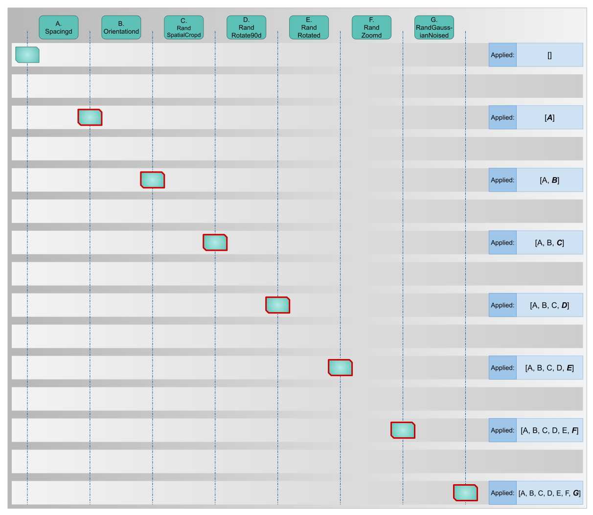
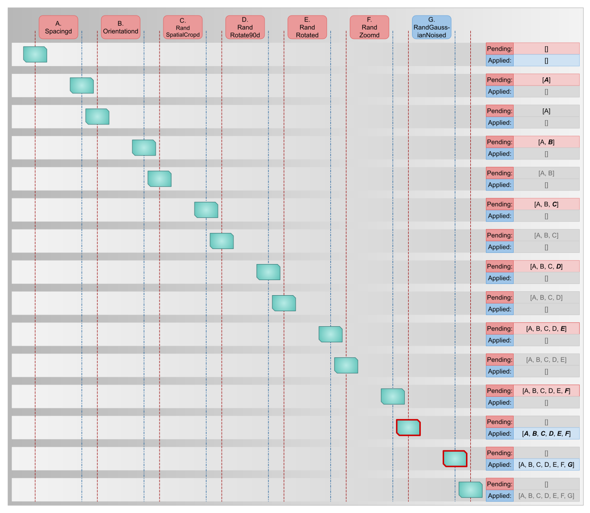
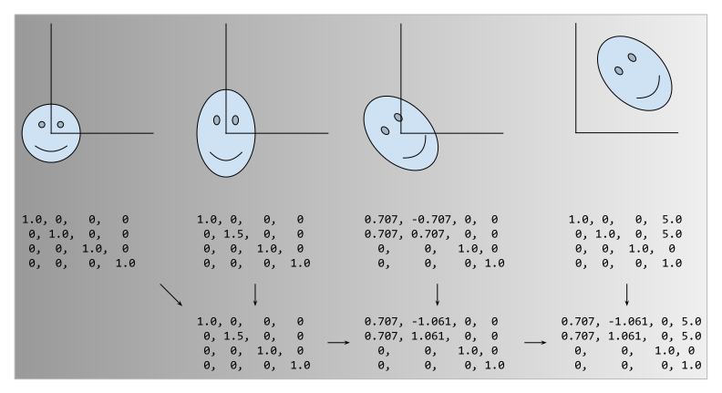

.. _lazy_resampling:

:github_url: https://github.com/Project-MONAI/MONAI

Lazy Resampling
===============

.. toctree::
   :maxdepth: 2

   config_syntax.md

Introduction
^^^^^^^^^^^^

Lazy Resampling is a new feature introduced in MONAI 1.2. This feature is still experimental at this time and it is
possible that behaviour and APIs will change in upcoming releases.

Lazy resampling reworks the way that preprocessing is performed. It improves upon standard preprocessing pipelines and
can provide significant benefits over traditional preprocessing. It can improve:
* pipeline execution time
* pipeline memory usage in CPU or GPU
* image and segmentation quality by reducing incidental noise and artifacts caused by resampling

The way it does this is by adopting the methods used in computer graphics pipelines, in which transformations to objects
in a scene are modified by composing together a sequence of "homogeneous matrices".

Rather than each transform being executed in isolation, potentially requiring the data to be resampled to make a new
tensor, transforms whose operations can be described in terms of homogeneous transforms do not execute their transforms
immediately. Instead, they create a "pending operation", which is added to a list of operations that will be fused
together and carried out at the point that they are required.

How Lazy Resampling changes preprocessing
^^^^^^^^^^^^^^^^^^^^^^^^^^^^^^^^^^^^^^^^^

In order to understand the difference between traditional pipelines and lazy pipelines, it is best to look at an example
pipeline and the differences between their execution strategies:

Traditional execution
+++++++++++++++++++++

With traditional resampling, found both in MONAI and many other preprocessing libraries, you typically define a sequence
of transforms and pass them to a ``Compose`` object, such as :class:`monai.transforms.compose.Compose`.

Example::

    transforms = [
        Spacingd(keys=["img", "seg"], ...),
        Orientationd(keys=["img", "seg"], ...),
        RandSpatialCropd(keys=["img", "seg"], ...),
        RandRotate90d(keys=["img", "seg"], ...),
        RandRotated(keys=["img", "seg"], ...),
        RandZoomd(keys=["img", "seg"], ...),
        RandGaussianNoised(keys="img", ...),
    ]
    pipeline = Compose(transforms)

    # elsewhere this will be called many times (such as in a Dataset instance)
    outputs = pipeline(inputs)

The following will then happen when we call ``pipeline(inputs)``:

1. ``Spacingd`` is called and interpolates the data samples
2. ``Orientationd`` permutes the data samples so that their spatial dimensions are reorganised
3. ``RandSpatialCropd`` crops a random patch of the data samples, throwing away the rest of the data in the process
4. ``RandRotate90d`` has a chance of performing a tensor-based rotation of the data samples
5. ``RandRotated`` has a chance of performing a full resample of the data samples
6. ``RandZoomd`` has a chance of performing a interpolation of the data samples
7. ``RandGaussianNoised`` has a chance of adding noise to ``img``

   Figure showing traditional pipeline execution. Tensors (the boxes in the main body of the image) are passed through
   the pipeline, and the state of their `applied_operations` property is shown at each step. Tensors with a thick red
   border have undergone some kind of resample operation at that stage.

Overall, there are up to three occasions where the data is either interpolated or resampled through spatial transforms
(``Spacingd``, ``RandRotated`` and ``RandZoomd``). Furthermore, the crop that occurs means that the output data
samples might contain pixels for which there is data but that show padding values, because the data was thrown away by
``RandSpatialCrop``.

Each of these operations takes time and memory, but, as we can see in the example above, also creates resampling
artifacts and can even destroy data in the resulting data samples.

Lazy execution
++++++++++++++

Lazy resampling works very differently. When you execute the same pipeline with `lazy=True`, the following happens:

#. ``Spacingd`` is executed lazily. It puts a description of the operation that it wants to perform onto a list of
   pending operations
#. ``Orientationd`` is executed lazily. It adds a description of its own operation to the pending operation list so
   now there are 2 pending operations
#. ``RandSpatialCropd`` is executed lazily. It adds a description of its own operation to the pending
   operation list so now there are 3 pending operations
#. ``RandRotate90d`` is executed lazily. It adds a description of its own operation to the pending operation
   list so now there are 4 pending operations
#. ``RandRotated`` is executed lazily. It adds a description of its own operation to the pending operation
   list so now there are 5 pending operations
#. ``RandZoomd`` is executed lazily. It adds a description of its own operation to the pending operation
   list so now there are 6 pending operations

   #. [Spacingd, Orientationd, RandSpatialCropd, RandRotate90d, RandRotated, RandZoomd] are all on the pending
      operations list but have yet to be carried out on the data
#. ``RandGaussianNoised`` is not a lazy transform. It is now time for the pending operations to be evaluated. Their
   descriptions are mathematically composited together, to determine the operation that results from all of them being
   carried out. This is then applied in a single resample operation. Once that is done, RandGaussianNoised operates on
   the resulting data

   Figure showing lazy pipeline execution. We show the state of the `pending_operations` and `applied_operations`
   properties of the tensor as it is processed by the pipeline. Thick red borders indicate some kind of resampling
   operation has taken place at that step. Lazy resampling performs far fewer of these operations.

The single resampling operation has less noise induced by resampling, as it only occurs once in this pipeline rather
than three times in the traditional pipeline. More importantly, although the crop describes an operation to keep only a
subset of the data sample, the crop is not performed until after the spatial transforms are completed, which means that
all of the data sample that is within bounds is preserved and is part of the resulting output.

Composing homogeneous matrices
++++++++++++++++++++++++++++++

Although a full treatment of homogeneous matrices is outside the scope of this document, a brief overview of them is
useful to understand the mechanics of lazy resampling. Homogeneous matrices are used in computer graphics to describe
operations in cartesian space in a unified (homogeneous) fashion. Rotation, scaling, translation, and skewing are
amongst the operations that can be performed. Homogeneous matrices have the interesting property that they can be
composited together, thus describing the result of a sequence of operations. Note that ordering is important;
`scale -> rotate -> translation` gives a very different result to `translation -> rotate -> scale`.

The ability to composite homogeneous matrices together allows a sequence of operations to be carried out as a single
operation, which is the key mechanism by which lazy resampling functions.

API changes
^^^^^^^^^^^

A number of new arguments have been added to existing properties, which we'll go over in detail here. In particular,
we'll focus on :class:`monai.transforms.compose.Compose` and :class:`LazyTrait<monai.transforms.traits.LazyTrait>`/
:class:`LazyTransform<monai.transforms.transform.LazyTransform>` and the way that they interact with each other.

Compose
+++++++

:class:`monai.transforms.compose.Compose<Compose>` gains a number of new arguments that can be used to control resampling
behaviour. Each of them is covered in its own section:

*``lazy``*

``lazy`` controls whether execution is carried out in a lazy manner or not. It has three values that it can take:

* `lazy=False` forces the pipeline to be executed in the standard way with every transform applied immediately
* `lazy=True` forces the pipeline to be executed lazily. Every transform that implements
  :class:`monai.transforms.traits.LazyTrait<LazyTrait>` (or inherits
  :class:`monai.transforms.transform.LazyTransform<LazyTransform>`) will be executed lazily
* `lazy=None` means that the pipeline can execute lazily, but only on transforms that have their own `lazy` property set to True.
