# Modules

MONAI aims at facilitating deep learning in medical image analysis at multiple granularities. This document provides an
overview of the modules and highlights the key capabilities.

The core codebase is designed as a library of lightweight, flexible, and comprehensive APIs for users with varying expertise.
The building blocks are made easy to understand and use, they are carefully decoupled and can be readily integrated
into existing PyTorch programs and larger systems. By leveraging the workflow and bundle APIs, users can also quickly
set up efficient and robust model training or evaluation pipelines for various domain-specific applications.

The overall architecture and modules are shown in the following figure:

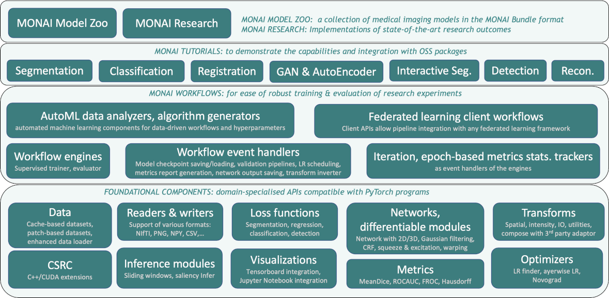

* [I/O, processing and augmentation](#i-o-processing-and-augmentation)
* [Datasets and Data Loading](#datasets-and-data-loading)
* [Differentiable components, networks, losses and optimizers](#differentiable-components-networks-losses-and-optimizers)
* [Evaluation](#evaluation)
* [Visualization](#visualization)
* [Workflows](#workflows)
* [Bundle](#bundle)
* [Federated Learning](#federated-learning)
* [Auto3dseg](#auto3dseg)
* [GPU acceleration, performance profiling and optimization](#gpu-acceleration-performance-profiling-and-optimization)

## I/O, processing and augmentation
Medical images require specialized methods for I/O, preprocessing and augmentation. They often follow specific formats,
are handled with specific protocols, and the data arrays are often high-dimensional.
[`monai.transforms`](https://github.com/Project-MONAI/MONAI/tree/dev/monai/transforms) and
[`monai.data`](https://github.com/Project-MONAI/MONAI/tree/dev/monai/data) modules include a set of domain-specific APIs
for various deep learning applications:

### Transforms with data in array and dictionary styles

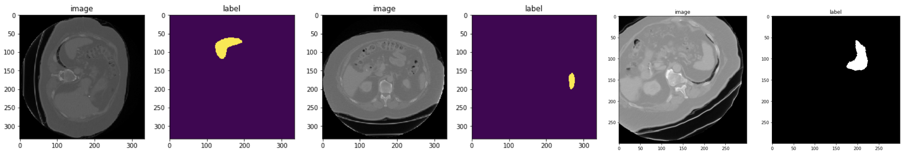

This enables basic image transformations, as well as more complex preprocessing pipelines such as synchronized operations
across different modalities and model supervision inputs. [[array and dict examples]](https://github.com/Project-MONAI/tutorials/tree/main/3d_segmentation/torch)

### Various image patch-based sampling mechanisms

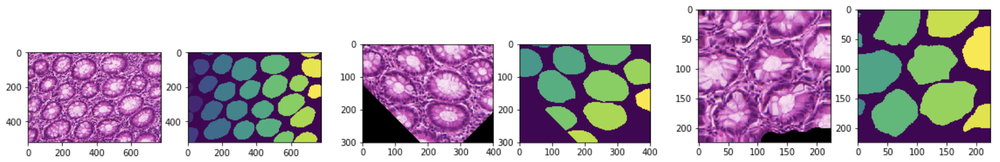

Advanced patch sampling methods are implemented for selective preprocessing, such as weighted, class-balanced sampling
from user-specified sampling weight maps.
The output can be in a sequence or iterator pattern which allows for different types of shuffling strategies.

### Image IO with third-party library integrations

Several backends are built-in and can support various formats. It is easily extensible for customized format readers.

### monai.data.MetaTensor

Core data structure combines PyTorch native Tensor APIs with metadata handling,
so that the deep learning models and pipelines can readily incorporate the meta information. [[MetaTensor]](https://colab.research.google.com/drive/1T4iAys-cC2qL80oJkIbAXAPlWNPwp4H7)

### GPU-based accelerations

Implementations are provided to ensure optimal usage of the underlying hardware resources. [[fast training guide]](https://github.com/Project-MONAI/tutorials/blob/main/acceleration/fast_model_training_guide.md)

### Determinism and reproducibility

They can be achieved with fine-level of local controls via the `Randomizable` API as well as globally
using `set_determinism`.

### Decollating and invertible transforms

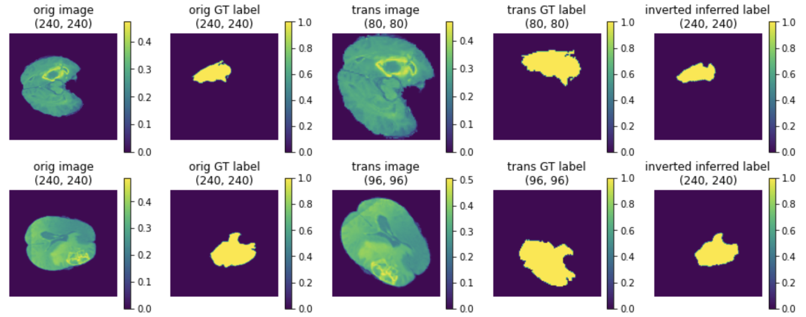
The mini-batch data output from a model can be decollated, post-processed independently, including inverting
the outputs to an earlier step of the preprocessing according to the tracked metadata and applied operations.
[[inverse transform demo]](https://github.com/Project-MONAI/tutorials/blob/main/modules/inverse_transforms_and_test_time_augmentations.ipynb)

### Enhanced usability

Additionally, utilities such as `DataStats` transform, `dev_collate`, and [visualization
methods](https://github.com/Project-MONAI/tutorials/blob/main/modules/transform_visualization.ipynb) are provided as
extensions to PyTorch for improved overall debugability.

## Datasets and Data Loading
Following PyTorch's design pattern, MONAI extends the `Dataset` and `DataLoader` APIs as major enhancements in terms of
domain-specific usability and pipeline performance.

### Cache IO and transforms data to accelerate training

Data-driven methods require many (potentially thousands of) epochs of training data reading and preprocessing. MONAI
provides multi-threaded cache-based datasets to accelerate the process [[Datasets experiment]](https://github.com/Project-MONAI/tutorials/blob/master/acceleration/dataset_type_performance.ipynb). The
cache can be persistent and dynamic (`SmartCacheDataset`) and reused across different experiments [[SmartCache example]](https://github.com/Project-MONAI/tutorials/blob/master/acceleration/distributed_training/unet_training_smartcache.py).
The following figure illustrates the training speedup compared with a regular PyTorch program.

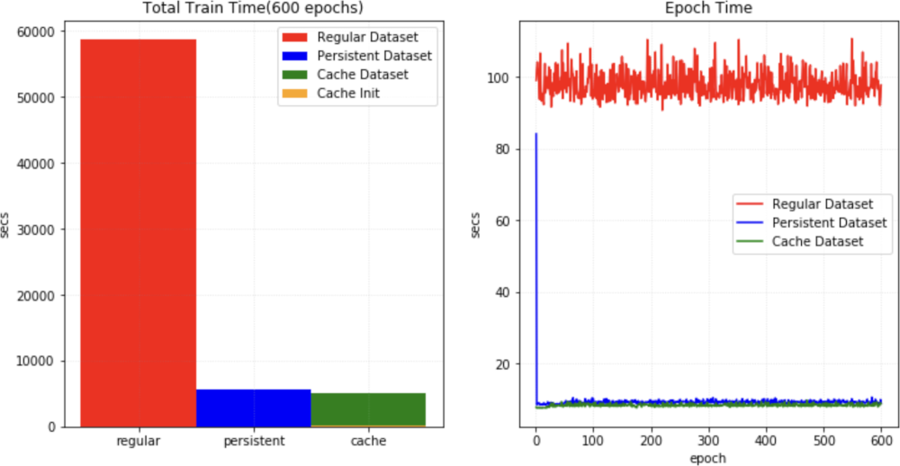

### `ThreadDataLoader` vs. `DataLoader`

If the transforms are light-weighted, especially when we cache all the data in RAM, the multiprocessing of PyTorch
`DataLoader` may cause unnecessary IPC time and decrease GPU utilization. MONAI provides `ThreadDataLoader` which
executes the transforms in a separate thread:

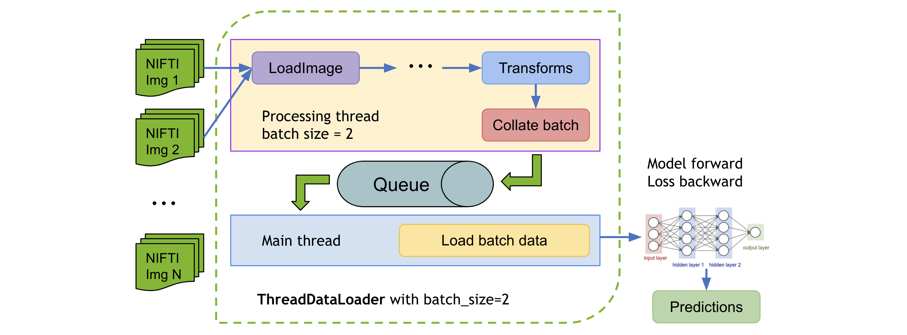

a `ThreadDataLoader` example is within the [Spleen fast training tutorial](https://github.com/Project-MONAI/tutorials/blob/master/acceleration/fast_training_tutorial.ipynb).

### Public datasets

To quickly get started with popular training data, MONAI provides several ready-to-integrate Dataset classes
(such as `MedNISTDataset`, `DecathlonDataset`, [`TciaDataset`](https://github.com/Project-MONAI/tutorials/blob/main/modules/tcia_dataset.ipynb)), which include data downloading, and support training/evaluation splits generation with transforms.
[[Public datasets tutorial]](https://github.com/Project-MONAI/tutorials/blob/master/modules/public_datasets.ipynb)
The common workflow of predefined datasets:

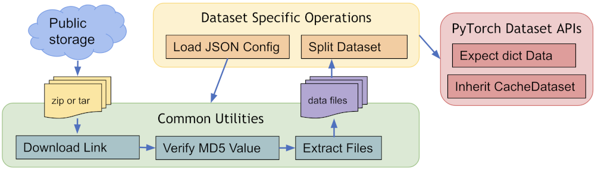

### Dataset type extensions

Other extensions of the `Dataset` API include: `ZipDataset` for associating multiple data sources, `PatchDataset` for
handling both image- and patch-level preprocessing, `CSVDataset` for multi-modal inputs, and `partition_dataset` for
cross-validation data preparations.

## Differentiable components, networks, losses and optimizers

Some deep neural network architectures have shown to be particularly effective for medical imaging analysis tasks.
MONAI implements reference networks with the aim of both flexibility and code readability.

### Predefined layers and blocks

Network layers and blocks are in general implemented to be compatible with spatial 1D, 2D and 3D inputs.
Users can easily integrate the layers, blocks and networks as part of their customised pipelines.
Various utilities are provided to leverage the existing model weights, e.g., finetuning [from MMAR](https://github.com/Project-MONAI/tutorials/blob/master/modules/transfer_mmar.ipynb)
or [from a bundle in MONAI model-zoo](https://github.com/Project-MONAI/tutorials/tree/main/model_zoo).

### C++/CUDA optimized modules

To further accelerate the domain-specific routines, MONAI C++/CUDA implementation is introduced as extensions of the PyTorch native implementations.
MONAI provides the modules using [the two ways of building C++ extensions from PyTorch](https://pytorch.org/tutorials/advanced/cpp_extension.html#custom-c-and-cuda-extensions):
- via `setuptools`, for modules including `Resampler`, `Conditional random field (CRF)`, `Fast bilateral filtering using the permutohedral lattice`.
- via just-in-time (JIT) compilation, for the `Gaussian mixtures` module. This approach allows for dynamic optimisation according to the user-specified parameters and local system environments.
The following figure shows results of MONAI's Gaussian mixture models applied to tissue and surgical tools segmentation:
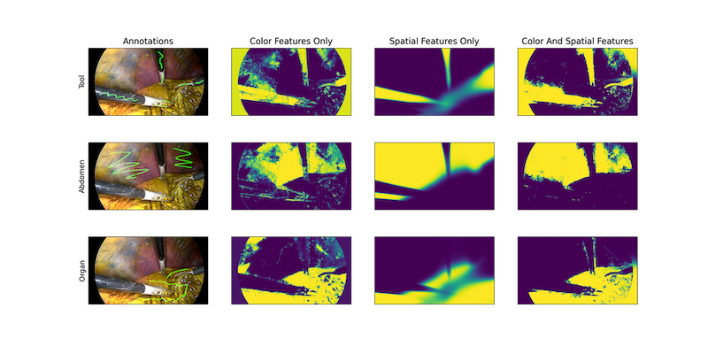


### Losses and optimizers

Commonly used loss functions for various applications are (re-)implemented from the literature, such as `DiceLoss`, `GeneralizedDiceLoss`, `TverskyLoss`, `DiceFocalLoss`.
The numerical optimizations and relevant utilities include `Novograd` and `LearningRateFinder`.
The following figure shows a learning rate search process.

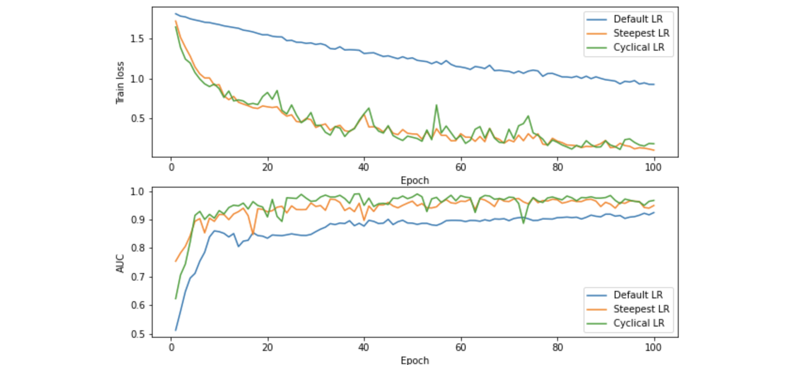

## Evaluation
To run model inferences and evaluate the model quality, MONAI provides reference implementations for the relevant
widely-used approaches. Currently, several popular evaluation metrics and inference patterns are included:

### Sliding window inference

For model inferences on large volumes, the sliding window approach is a popular choice to achieve high performance while
having flexible memory requirements (_alternatively, please check out the latest research on [model parallel
training](#lamp-large-deep-nets-with-automated-model-parallelism-for-image-segmentation) using MONAI_). It also supports
`overlap` and `blending_mode` configurations to handle the overlapped windows for better performances.

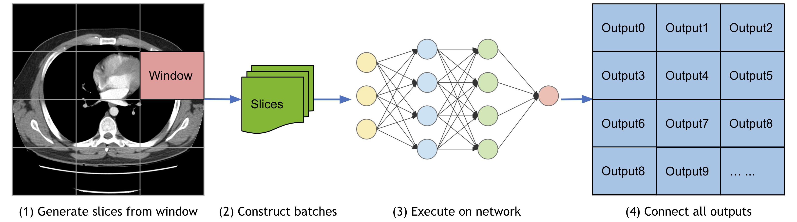

### Metrics for medical tasks

Various useful evaluation metrics have been implemented to measure the quality of medical image specific models.
These include `Mean Dice`, `ROCAUC`, `Confusion Matrices`, `Hausdorff
Distance`, `Surface Distance`, `Occlusion Sensitivity`.
The APIs also support [multi-processing computation](https://github.com/Project-MONAI/tutorials/blob/master/modules/compute_metric.py).

### Report generation
`MetricsSaver` is provided to write the final metric summary report: `mean`, `median`, `max`, `min`, `<int>percentile`, `std`:

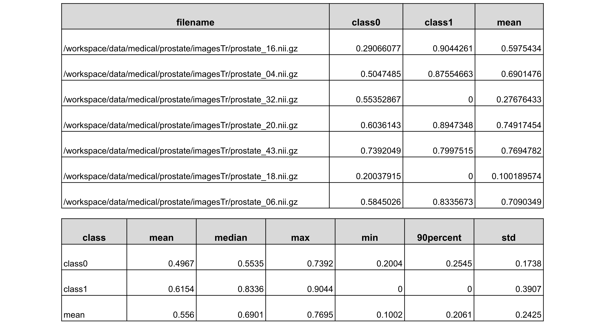

## Visualization
Beyond the simple point and curve plotting, intuitive interfaces are provided to visualize multidimensional data as GIF animations in TensorBoard. This could provide a quick qualitative assessment of the model by visualizing, for example, the volumetric inputs, segmentation maps, and intermediate feature maps. A runnable example with visualization is available at [UNet training example](https://github.com/Project-MONAI/tutorials/blob/master/3d_segmentation/torch/unet_training_dict.py). To work with ignite program, MONAI also provides several ignite handlers to visualize training curve and metrics with `TensorBoard` or `MLFlow`, more details is available in [TensorBoard and MLFlow handlers example](https://github.com/Project-MONAI/tutorials/blob/master/3d_segmentation/unet_segmentation_3d_ignite.ipynb).

To easily visualize a 3D image as frames of 2D images, MONAI provides the utility `matshow3d` based on `matplotlib` library. It can plot frames of image for the specified dimension, showing a spleen 3D image as example:
`matshow3d(volume=image, figsize=(100, 100), every_n=10, frame_dim=-1 show=True, cmap="gray")`

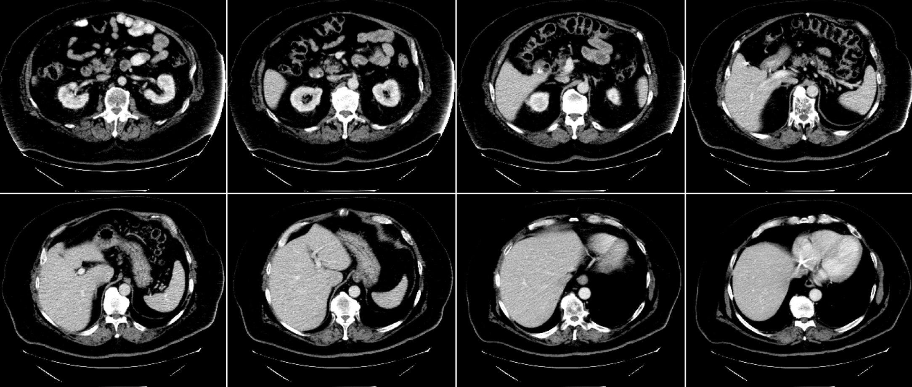

MONAI also provides the `blend_images` utility to blend the `image` and `label` to an RGB color image to better visualize the segmentation regions with the specified `cmap` mode and weights, etc. Showing a spleen segmentation `image` and the corresponding `label` as example:

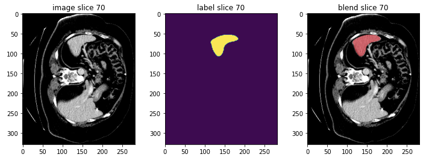

For more details of `TensorBoard utility`, `matshow3d` and `blend_images`, please check the [visualization tutorial](https://github.com/Project-MONAI/tutorials/blob/master/modules/transform_visualization.ipynb).

And to visualize the class activation mapping for a trained classification model, MONAI provides CAM, GradCAM, GradCAM++ APIs for both 2D and 3D models:

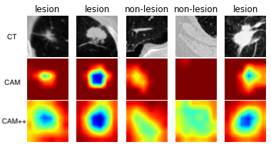

The above example is generated by computing [GradCAM/GradCAM++ from a lung CT lesion classification model](https://github.com/Project-MONAI/tutorials/tree/master/modules/interpretability).

## Workflows

MONAI engines and workflows enable quick start of training and evaluation experiments.

These features decouple the domain-specific components and the generic machine learning processes.
They also provide a set of unify APIs for higher level applications (such as AutOML, Federated Learning).
The trainers and evaluators of the workflows are compatible with pytorch-ignite `Engine` and `Event-Handler` mechanism.

### General workflows pipeline

The workflow and some of MONAI event handlers are shown as below [[Workflow examples]](https://github.com/Project-MONAI/tutorials/tree/master/modules/engines):

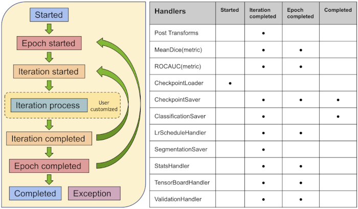


### EnsembleEvaluator

A typical ensemble procoess is implemented as a ready-to-use workflow [[Cross validation and model ensemble tutorial]](https://github.com/Project-MONAI/tutorials/blob/master/modules/cross_validation_models_ensemble.ipynb):
1. Split all the training dataset into K folds.
2. Train K models with every K-1 folds data.
3. Execute inference on the test data with all the K models.
4. Compute the average values with weights or vote the most common value as the final result.

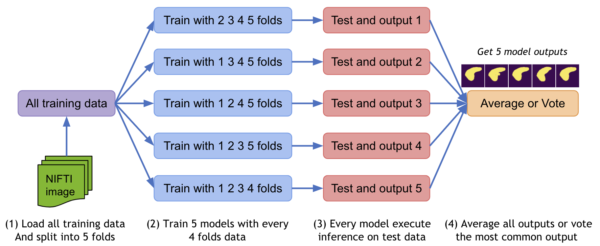


### Decollate batch data for flexible post-processings

`decollate batch` is introduced since MONAI v0.6, which simplifies the post-processing transforms and provides flexible following operations on a batch of data with various data shapes. It can decollate batched data (e.g. model predictions) into a list of tensors, for the benefits such as:
1. enabling postprocessing transforms for each item independently -- randomised transforms could be applied differently for each predicted item in a batch.
2. simplifying the transform APIs and reducing the input validation burdens because both the preprocessing and postprocessing transforms now only need to support the "channel-first" input format.
3. enabling the `Invertd` transform for the predictions and the inverted data with different shapes, as the data items are in a list, not stacked in a single tensor.
4. allowing for both batch-first tensor and list of channel-first tensors in a flexible metric computation. [[decollate batch tutorial]](https://github.com/Project-MONAI/tutorials/blob/master/modules/decollate_batch.ipynb)

A typical process of `decollate batch` is illustrated as follows (with a `batch_size=N` model predictions and labels as an example):

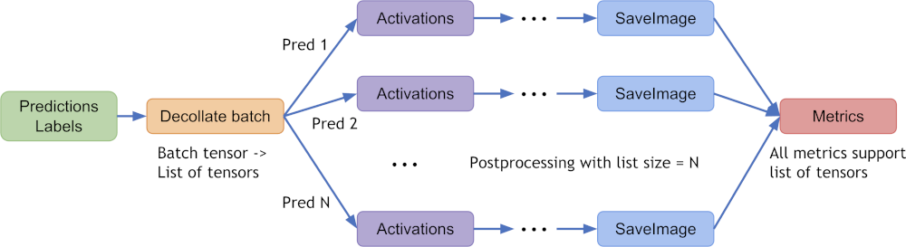

### Easy to integrate into popular workflows

Except for the pytorch-ignite based `monai.engines`, most of the MONAI modules could be used independently or combined
with other software packages. For example, MONAI can be easily integrated into popular frameworks such as
PyTorch-Lightning and Catalyst. [[Lightning segmentation](https://github.com/Project-MONAI/tutorials/blob/master/3d_segmentation/spleen_segmentation_3d_lightning.ipynb),
[Catalyst segmentation](https://github.com/Project-MONAI/tutorials/blob/master/3d_segmentation/unet_segmentation_3d_catalyst.ipynb)]

## Bundle

The objective of a MONAI bundle is to define a packaged model which includes the critical information necessary to allow
users and programs to understand how the model is used and for what purpose. A bundle includes the stored weights of a
single network as a pickled state dictionary plus optionally a Torchscript object and/or an ONNX object. Additional JSON
files are included to store metadata about the model, information for constructing training, inference, and
post-processing transform sequences, plain-text description, legal information, and other data the model creator wishes
to include. More details are available at [bundle specification](https://docs.monai.io/en/latest/mb_specification.html).

The key benefits of bundle are to define the model package and support building Python-based workflows via structured configurations:
- Self-contained model package include all the necessary information.
- Structured config can be used to easily reconstruct or prototype deep learning workflows.
- Config files can provide good readability and usability by separating parameter settings from the Python code.
- Config files can describe flexible workflow and components, allows for different low-level Python implementations
- Learning paradigms at a higher level such as federated learning and AutoML can be decoupled from the component details.

A typical bundle example can include:
```
  ModelName
  ┣━ configs
  ┃  ┗━ metadata.json
  ┣━ models
  ┃  ┣━ model.pt
  ┃  ┣━ *model.ts
  ┃  ┗━ *model.onnx
  ┗━ docs
     ┣━ *README.md
     ┗━ *license.txt
```
Details about the bundle config definition and syntax & examples are at [config syntax](https://docs.monai.io/en/latest/config_syntax.html).
A step-by-step [get started](https://github.com/Project-MONAI/tutorials/blob/master/modules/bundles/get_started.ipynb) tutorial notebook can help users quickly set up a bundle. [[bundle examples](https://github.com/Project-MONAI/tutorials/tree/main/bundle), [model-zoo](https://github.com/Project-MONAI/model-zoo)]

## Federated Learning


Using the MONAI bundle configurations, we can use MONAI's [`MonaiAlgo`](https://docs.monai.io/en/latest/fl.html#monai.fl.client.MonaiAlgo) class (an implementation of the abstract [`ClientAlgo`](https://docs.monai.io/en/latest/fl.html#clientalgo) class for federated learning)
to execute bundles from the [MONAI model zoo](https://github.com/Project-MONAI/model-zoo).
Note that [`ClientAlgo`](https://docs.monai.io/en/latest/fl.html#clientalgo) is provided as an abstract base class for defining an algorithm to be run on any federated learning platform.
[`MonaiAlgo`](https://docs.monai.io/en/latest/fl.html#monai.fl.client.MonaiAlgo) implements the main functionalities needed to run federated learning experiments, namely `train()`, `get_weights()`, and `evaluate()`.
On top, it provides implementations for life-cycle management of the component such as `initialize()`, `abort()`, and `finalize()`.

[NVIDIA FLARE](https://github.com/NVIDIA/NVFlare), the federated learning platform developed by NVIDIA, has already built [the integration piece](https://github.com/NVIDIA/NVFlare/tree/2.2/integration/monai)
with [`ClientAlgo`](https://docs.monai.io/en/latest/fl.html#clientalgo) to allow easy experimentation with MONAI bundles within their federated environment.
[[Federated learning tutorial]](https://github.com/Project-MONAI/tutorials/tree/main/federated_learning/nvflare)

## Auto3dseg


[Auto3DSeg](https://monai.io/apps/auto3dseg.html) is a comprehensive solution for large-scale 3D medical image segmentation.
It leverages the latest advances in MONAI
and GPUs to efficiently develop and deploy algorithms with state-of-the-art performance.
It first analyzes the global information such as intensity, dimensionality, and resolution of the dataset,
then generates algorithms in MONAI bundle format based on data statistics and [algorithm templates](https://github.com/Project-MONAI/research-contributions/tree/main/auto3dseg).
Next, all algorithms initiate model training to obtain checkpoints with the best validation performance.
Finally, the ensemble module selects the algorithms via ranking trained checkpoints and creates ensemble predictions.

The solution offers different levels of user experience for beginners and advanced researchers.
It has been tested on large-scale 3D medical imaging datasets in different modalities.

## GPU acceleration, performance profiling and optimization

MONAI provides state-of-the-art performance optimization methods including:

### Auto mixed precision (AMP)

Simply set `amp=True/False` in `SupervisedTrainer` or `SupervisedEvaluator` during training or evaluation to enable/disable AMP
Example benchmark results are as follows [[AMP training tutorial]](https://github.com/Project-MONAI/tutorials/blob/master/acceleration/automatic_mixed_precision.ipynb):

training with AMP ON/OFF on a NVIDIA V100 GPU with CUDA 11 and PyTorch 1.6:

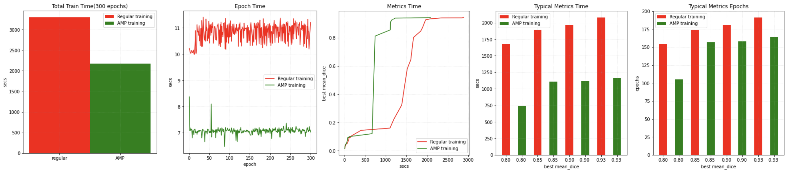

training with AMP ON/OFF on a NVIDIA A100 GPU with CUDA 11 and PyTorch 1.6:

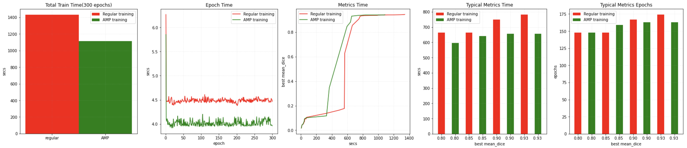

Several tools including `DLProf`, `Nsight`, `NVTX` and `NVML` can be used with MONAI to identify the performance bottleneck. [[profiling tutorial]](https://github.com/Project-MONAI/tutorials/blob/master/performance_profiling/radiology/profiling_train_base_nvtx.md)

### Distributed training

The distributed data-parallel APIs of MONAI are compatible with the native PyTorch distributed module, pytorch-ignite distributed module, Horovod, XLA, and the SLURM platform.
[[distributed training tutorial]](https://github.com/Project-MONAI/tutorials/blob/master/acceleration/distributed_training/brats_training_ddp.py)

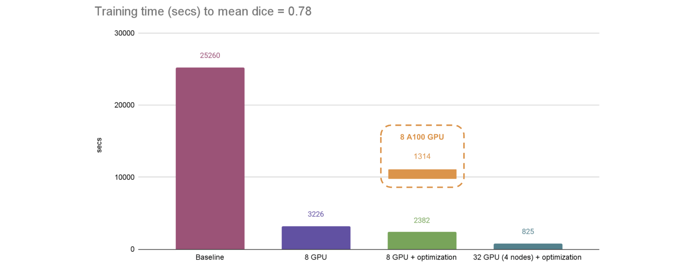

The [fast training tutorial](https://github.com/Project-MONAI/tutorials/blob/master/acceleration/fast_training_tutorial.ipynb)
combines `AMP` with `CacheDataset`, `GPU cache`, `GPU transforms`, `ThreadDataLoader`, tuning of networks and optimizers, can achieve substantial speedup compared
with a PyTorch regular implementation.
