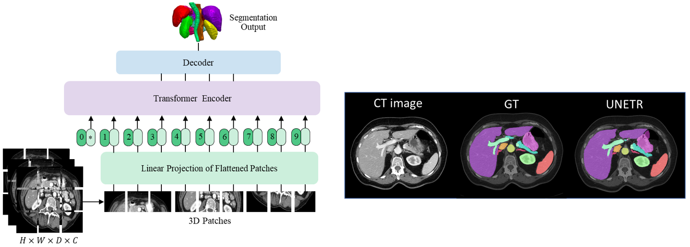
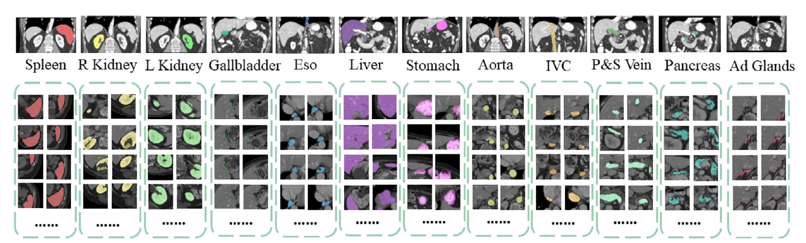
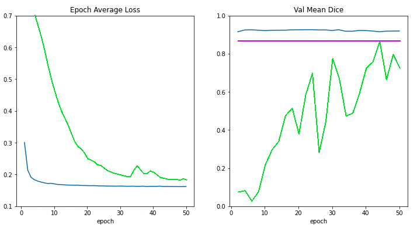

# What's new in 0.6

- Decollating mini-batches as an essential post-processing step
- Pythonic APIs to load the pretrained models from Clara Train MMARs
- UNETR: Transformers for Medical Image Segmentation
- Enhancements of the base metric interfaces
- C++/CUDA extension modules via PyTorch JIT compilation
- Backward compatibility and enhanced continuous integration/continuous delivery
- Collaboration with Project-MONAI/MONAILabel for smooth integration

## Decollating mini-batches as an essential post-processing step
`decollate batch` is introduced in MONAI v0.6, to simplify the post-processing transforms and enable flexible operations on a batch of model outputs.
It can decollate batched data (e.g. model inference results) into a list of tensors -- as an 'inverse' operation of `collate_fn` of the PyTorch data loader. It has the benefits such as:
- enabling postprocessing transforms for each item independently, for example, randomised transforms could be applied differently for each predicted item in a batch.
- simplifying the transform APIs and reducing the input validation burdens, because both the preprocessing and postprocessing transforms now only support the "channel-first" input format.
- enabling the transform inverse operation for data items in different original shapes, as the inverted items are in a list, instead of being stacked in a single tensor.
- allowing for both a "batch-first" tensor and a list of "channel-first" tensors for flexible metric computation.

A typical process of `decollate batch` is illustrated as follows (with a `batch_size=N` model predictions and labels as an example):

[decollate batch tutorial](https://github.com/Project-MONAI/tutorials/blob/master/modules/decollate_batch.ipynb) shows a detailed usage example based on a PyTorch native workflow.

[Migrating your v0.5 code to v0.6](https://github.com/Project-MONAI/MONAI/wiki/v0.5-to-v0.6-migration-guide) wiki shows how to migrate an existing program from v0.5 to v0.6 to adapt to the `decollate batch` logic.

## UNETR: Transformers for Medical Image Segmentation
[UNETR](https://arxiv.org/abs/2103.10504) is a transformer-based model for volumetric (3D) medical image segmentation and is currently the state-of-the-art on [BTCV dataset](https://www.synapse.org/#!Synapse:syn3193805/wiki/217752) test server for the task of multi-organ semantic segmentation. UNETR is introduced in MONAI v0.6 and its flexible implementation supports various segmentation tasks.

A tutorial for the task of 3D multi-organ semantic segmentation using UNETR is provided within
[`project-monai/tutorials`](https://github.com/Project-MONAI/tutorials/blob/master/3d_segmentation/unetr_btcv_segmentation_3d.ipynb).
And it contains the following features:
- Transforms for dictionary format data,
- Defining a new transform according to MONAI transform API,
- Loading Nifti image with metadata, loading a list of images and stacking them,
- Randomly adjusting the intensity for data augmentation,
- Optimized cache IO and transforms to accelerate training and validation,
- 3D UNETR model, DiceCE loss function and Mean Dice metric for multi-organ segmentation task,

The following illustrates target body organs that are segmentation in this tutorial:

Please visit UNETR repository for more details:
https://monai.io/research/unetr-btcv-multi-organ-segmentation

## Pythonic APIs to load the pretrained models from Clara Train MMARs
[The MMAR (Medical Model ARchive)](https://docs.nvidia.com/clara/clara-train-sdk/pt/mmar.html)
defines a data structure for organizing all artifacts produced during the model development life cycle.
NVIDIA Clara provides [various MMARs of medical domain-specific models](https://ngc.nvidia.com/catalog/models?orderBy=scoreDESC&pageNumber=0&query=clara_pt&quickFilter=&filters=).
These MMARs include all the information about the model including configurations and scripts to provide a workspace to perform model development tasks. To better leverage the trained MMARs released on Nvidia GPU cloud, MONAI provides pythonic APIs to access them.

To demonstrate this new feature, a medical image segmentation tutorial is created within
[`project-monai/tutorials`](https://github.com/Project-MONAI/tutorials/blob/master/modules/transfer_mmar.ipynb).
It mainly produces the following figure to compare the loss curves and validation scores for
- training from scratch (the green line),
- applying pretrained MMAR weights without training (the magenta line),
- training from the MMAR model weights (the blue line),

according to the number of training epochs:

The tutorial shows the capability of encapsulating the details of MMAR parsing, as well as the potential of using pretrained MMARs for transfer learning.
These APIs are also being integrated into AI-assisted interactive workflows to accelerate the manual annotating processes (e.g. via [project-MONAI/MONAILabel](https://github.com/Project-MONAI/MONAILabel)).

## Enhancements of the base metric interfaces
The base API for metrics is now enhanced to support the essential computation logic for both iteration and epoch-based metrics.
With this update, the MONAI metrics module becomes more extensible, and thus a good starting point for customised metrics.
The APIs also by default support data parallel computation and consider the computation efficiency:  with a `Cumulative` base class, intermediate metric outcomes can be automatically buffered, cumulated, synced across distributed processes, and aggregated for the final results. The [multi-processing computation example](https://github.com/Project-MONAI/tutorials/blob/master/modules/compute_metric.py) shows how to compute metrics based on saved predictions and labels in multi-processing environment.

## C++/CUDA extension modules via PyTorch JIT compilation
To further accelerate the domain-specific routines in the workflows, MONAI C++/CUDA modules are introduced as extensions of the PyTorch native implementation.
It now provides modules using [the two ways of building C++ extensions from PyTorch](https://pytorch.org/tutorials/advanced/cpp_extension.html#custom-c-and-cuda-extensions):
- via `setuptools` (since MONAI v0.5), for modules including `Resampler`, `Conditional random field (CRF)`, `Fast bilateral filtering using the permutohedral lattice`.
- via just-in-time (JIT) compilation (since MONAI v0.6), for the `Gaussian mixtures` module. This approach allows for dynamic optimisation according to the user-specified parameters and local system environments.
The following figure shows results of MONAI's Gaussian mixture models applied to a tissue and surgical tools segmentation task:

## Backward compatibility and enhanced continuous integration/continuous delivery
Starting from this version, we experiment with basic policies of backward compatibility.
New utilities are introduced on top of the existing semantic versioning modules, and the git branching model.

At the same time, we actively analyze efficient, scalable, and secure CI/CD solutions to accommodate fast and collaborative codebase development.

Although a complete mechanism is still under development, these provide another essential step towards API-stable versions of MONAI, sustainable release cycles, and efficient open-source collaborations.

## Collaboration with [`Project-MONAI/MONAILabel`](https://github.com/Project-MONAI/MONAILabel) for smooth integration
Since MONAI v0.6, we welcome [`MONAILabel`](https://github.com/Project-MONAI/MONAILabel) under [`Project-MONAI`](https://github.com/Project-MONAI).

MONAI Label is an intelligent open source image labeling and learning tool that enables users to create annotated datasets and build AI annotation models for clinical evaluation.
MONAI Label enables application developers to build labeling apps in a serverless way,
where custom labeling apps are exposed as a service through the MONAI Label Server.

Please visit MONAILabel documentation website for details:
https://docs.monai.io/projects/label/en/latest/
