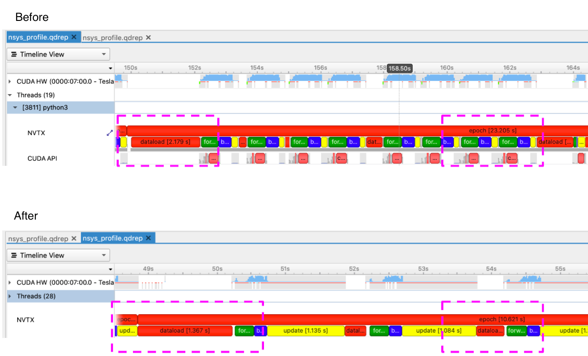

# What's new in 0.7

- Performance enhancements with profiling and tuning guides
- Major usability improvements in `monai.transforms`
- Reimplementing state-of-the-art Kaggle solutions
- Vision-language multimodal transformer architectures

## Performance enhancements with profiling and tuning guides

Model training is often a time-consuming step during deep learning development,
especially for medical imaging applications. Even with powerful hardware (e.g.
CPU/GPU with large RAM), the workflows often require careful profiling and
tuning to achieve high performance. MONAI has been focusing on performance
enhancements, and in this version, a fast model training guide is provided
to help build highly performant workflows, with a comprehensive overview of
the profiling tools and practical strategies:
https://github.com/Project-MONAI/tutorials/blob/master/acceleration/fast_model_training_guide.md.

The following figure shows the use of [Nvidia Nsight™ Systems](https://developer.nvidia.com/nsight-systems) for system-wide
performance analysis during a performance enhancement study.

With the performance profiling and enhancements, several typical use cases were studied to
improve the training efficiency.  The following figure shows that fast
training using MONAI can be `200` times faster than a regular baseline ([learn
more](https://github.com/Project-MONAI/tutorials/blob/master/acceleration/fast_training_tutorial.ipynb)), and it's `20` times faster than the MONAI v0.6 fast training solution.

## Major usability improvements in `monai.transforms` for NumPy/PyTorch inputs and backends

 MONAI starts to roll out major usability enhancements for the
 `monai.transforms` module. Many transforms are now supporting both NumPy and
 PyTorch, as input types and computational backends. To get the supported backends of every transform, please execute: `python monai/transforms/utils.py`.

One benefit of these enhancements is that the users can now better leverage the
GPUs for preprocessing. By transferring the input data onto GPU using
`ToTensor` or `EnsureType`, and applying the GPU-based transforms to the data,
[the tutorial of spleen
segmentation](https://github.com/Project-MONAI/tutorials/blob/master/acceleration/fast_training_tutorial.ipynb)
shows the great potential of using the flexible modules for fast and efficient
training.

## Reimplementing state-of-the-art Kaggle solutions

With this release, we actively evaluate and enhance the quality and flexibility
of the MONAI core modules, using the public Kaggle challenge as a testbed. [A
reimplementation](https://github.com/Project-MONAI/tutorials/tree/master/kaggle/RANZCR/4th_place_solution)
of a state-of-the-art solution at [Kaggle RANZCR CLiP - Catheter and Line
Position
Challenge](https://www.kaggle.com/c/ranzcr-clip-catheter-line-classification)
is made available in this version.

##  Vision-language multimodal transformers

In this release, MONAI adds support for training multimodal (vision + language)
transformers that can handle both image and textual data. MONAI introduces the
`TransCheX` model which consists of vision, language, and mixed-modality
transformer layers for processing chest X-ray and their corresponding
radiological reports within a unified framework. In addition to `TransCheX`,
users have the flexibility to alter the architecture by varying the number of
vision, language and mixed-modality layers and customizing the classification
head. In addition, the model can be initialized from pre-trained BERT language
models for fine-tuning.
