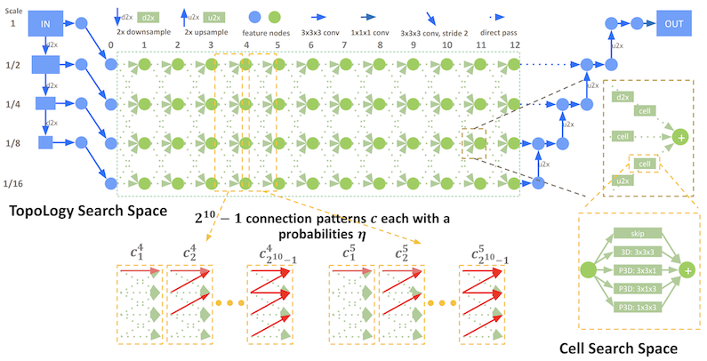
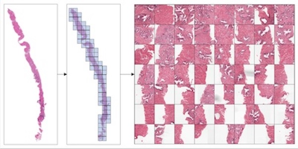
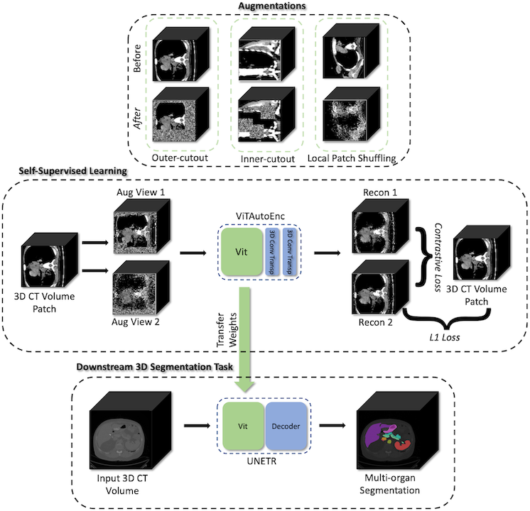

# What's new in 0.8 🎉🎉

- Differentiable neural network topology search
- Multiple instance learning for digital pathology WSI analysis
- Self-supervised representation learning
- Major usability improvements in `monai.transforms`

## Differentiable neural network topology search
MONAI integrates `DiNTS`: [Differentiable Neural Network Topology Search for 3D
Medical Image Segmentation](https://arxiv.org/abs/2103.15954). The neural
architecture search module supports flexible multi-path topology search with
high search efficiency and budgeted memory usage.

It provides a topology guaranteed discretization algorithm and a
discretization-aware topology loss for the search stage to minimize the
discretization gap. The module is memory usage aware and is able to search 3D
networks with different GPU memory requirements. For more details, please check out the
[DiNTS tutorial](https://monai.io/research/dints.html).

## Multiple instance learning for digital pathology WSI analysis
For [classification of digital pathology whole slide images
(WSI)](https://arxiv.org/abs/2111.01556), MONAI introduces new transforms and
network modules for multiple instance learning. These include self-attention
transformer blocks for explicitly accounting of the dependencies between instances
(image patches) during training. For more details,
please check out the [multiple instance learning tutorial](https://github.com/Project-MONAI/tutorials/tree/master/pathology/multiple_instance_learning).

## Self-supervised representation learning
MONAI starts to explore self-supervised representation learning in this
milestone release. The Vision Transformer has been extended to learn from self-supervised
reconstruction tasks with various data augmentation and a regularized
contrastive loss. The weights of the pre-trained backbone could be used to
enhance the performance of the novel downstream deep learning tasks.

The [tutorial](https://github.com/Project-MONAI/tutorials/tree/master/self_supervised_pretraining)
shows how to generate a good set of pre-trained weights using unlabeled data
with self-supervised tasks, then use the pre-trained weights to perform
fine-tuning on a fully supervised volumetric segmentation task using a transformer based `UNETR`.

## Major usability improvements in `monai.transforms`
`monai.transforms` are now more flexible and easy to use in version 0.8.
- Input type handling and backend APIs are improved to support both
  NumPy and PyTorch where possible.
- Visual examples are added to the documentation to illustrate the effects of
  various image processing.
- New visualization utilities are provided and enhanced for quick qualitative
  assessments of the model by visualizing, for example, the volumetric image
  inputs, segmentation maps, and intermediate feature maps.
  The visualization tutorial is available for
  [TensorBoard utility, `matshow3d` and `blend_images`](https://github.com/Project-MONAI/tutorials/blob/master/modules/transform_visualization.ipynb).
