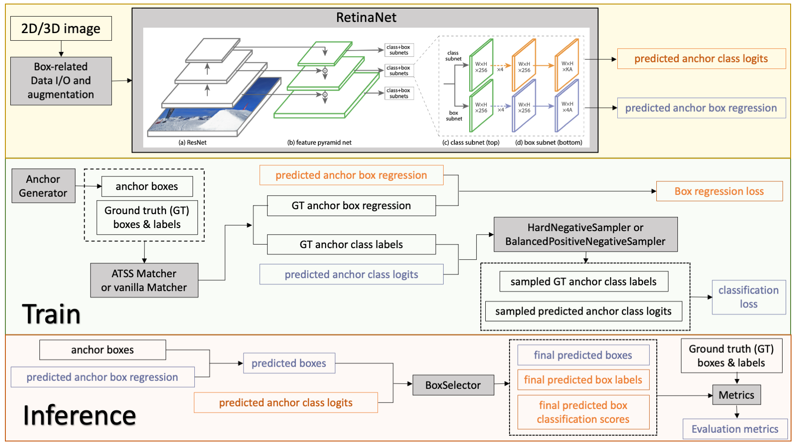
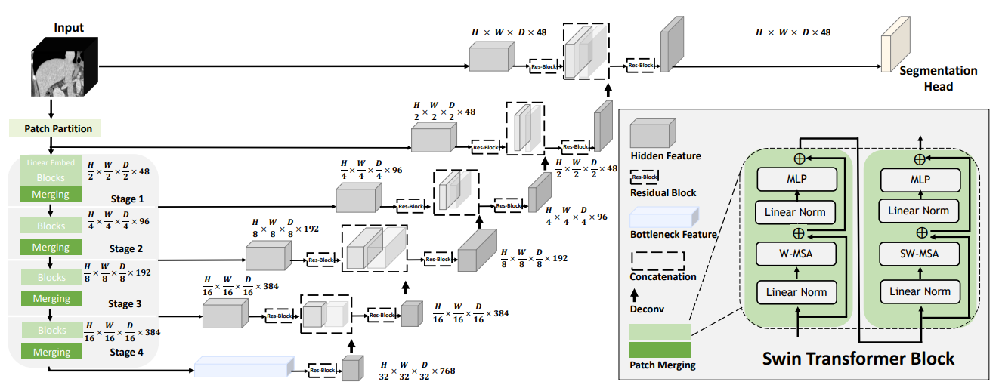
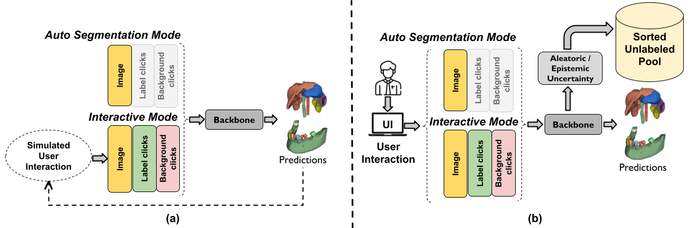
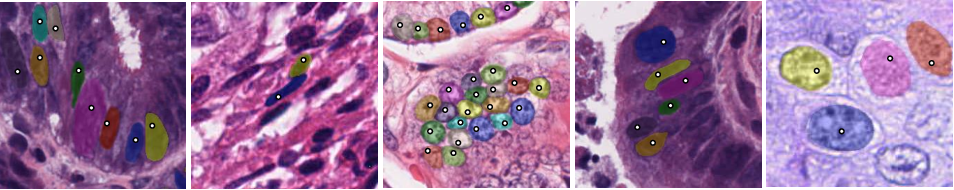

# What's new in 0.9 🎉🎉

- MONAI Bundle
- Object detection in medical images
- Swin Transformers for 3D medical image analysis
- New interactive segmentation components
- MetaTensor API preview

## MONAI Bundle
MONAI Bundle format defines portable described of deep learning models ([docs](https://docs.monai.io/en/latest/bundle_intro.html)).
A bundle includes the critical information necessary during a model development life cycle, 
and allows users and programs to understand the purpose and usage of the models.
The key benefits of Bundle and the `monai.bundle` APIs are:
- Standardized packaging format for storing and sharing models,
- Structured configuration files for fast prototyping of deep learning workflows,
- Easy to program APIs to separate deep learning hyperparameter settings from the Python code,
- Flexible config components to allow for different low-level Python implementations,
- Help to decouple the component details from higher level learning paradigms such as federated learning and AutoML.

More details are [in the tutorials](https://github.com/Project-MONAI/tutorials/tree/main/modules/bundle).

## Object detection in medical images
This release includes essential components for object localization and categorization workflows.
The initial developments include 2D and 3D bounding box handling, network blocks and architectures of RetinaNet,
and common utility modules such as coordinate-based preprocessing, hard negative sampler.

The application specific modules are made available at
[monai.apps.detection](https://github.com/Project-MONAI/MONAI/tree/dev/monai/apps/detection).

## Swin Transformers for 3D medical image analysis
The Swin UNETR model is now implemented in MONAI.
[The tutorial](https://github.com/Project-MONAI/tutorials/blob/main/3d_segmentation/swin_unetr_btcv_segmentation_3d.ipynb)
shows examples of multi-organ segmentation using this state-of-the-art model,
with weights from self-supervised pre-training of
Swin UNETR encoder (3D Swin Transformer) on a cohort of 5050 CT scans from publicly available datasets.
[The research-contribution entry](https://github.com/Project-MONAI/research-contributions/tree/main/SwinUNETR)
includes further technical details.

## New interactive segmentation components
New components from deep learning interactive segmentation workflows
such as [DeepEdit](https://github.com/Project-MONAI/tutorials/tree/main/deepedit/ignite)
and NuClick are integrated into the core codebase. They serve as basic building blocks for
[the latest features in MONAILabel](https://github.com/Project-MONAI/MONAILabel).

## MetaTensor API preview
The metadata associated with the primary imaging modalities is important in many biomedical applications,
especially for the data-driven approaches that MONAI has been focusing.
Starting from this release, we roll out a major refactoring for data representation in MONAI. For the first
step, [the core data structures](https://github.com/Project-MONAI/MONAI/blob/dev/monai/data/meta_tensor.py)
`MetaTensor` and `MetaObj` are implemented as a feature preview.
Further developments [on the feature branch](https://github.com/Project-MONAI/MONAI/tree/feature/MetaTensor)
will be made available in future milestone releases.
