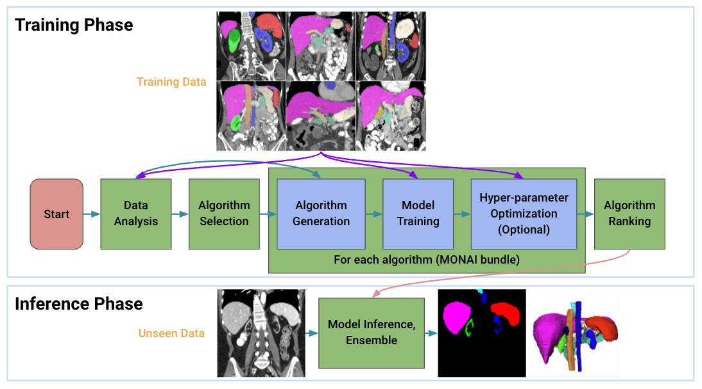
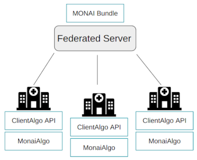
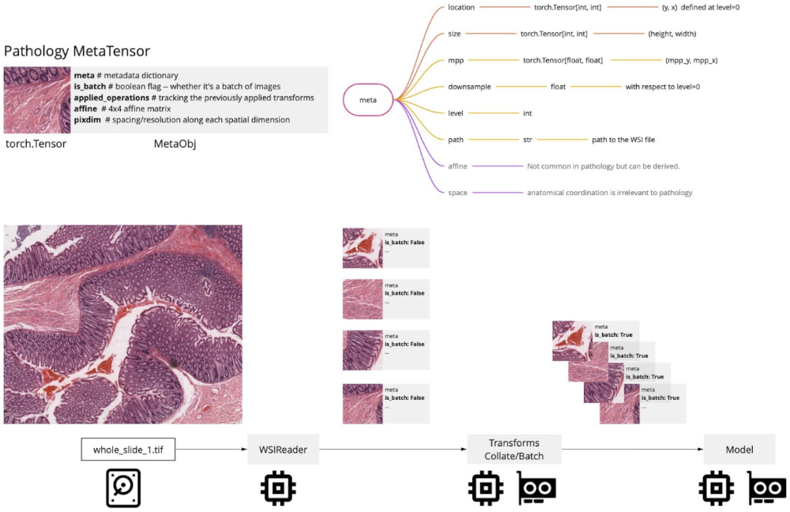
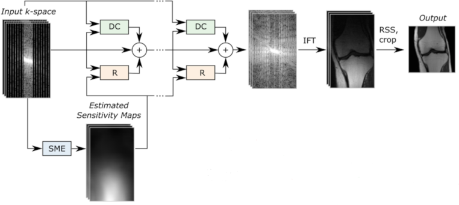

# What's new in 1.0 🎉🎉

- Model Zoo
- Auto3DSeg
- Federated Learning Client
- MetaTensor Support for Digital Pathology Workflows
- Accelerated MRI Reconstruction

## Model Zoo
The MONAI Model Zoo is a place for researchers and data scientists to use and share the latest and great models from the community.
Utilizing [the MONAI Bundle format](https://github.com/Project-MONAI/tutorials/tree/main/bundle) makes it easy to quickly get started using any model with any MONAI Framework (Core, Label, or Deploy).
Or, if you're interested in [contributing your models](https://github.com/project-monai/model-zoo), take a look at our contributing guidelines,
which walks you through the process and requirements for submitting your model.
For more details about how to use the models, please see [the tutorials](https://github.com/Project-MONAI/tutorials/tree/main/model_zoo).

## Auto3DSeg

[Auto3DSeg](https://monai.io/apps/auto3dseg.html) is a comprehensive solution for large-scale 3D medical image segmentation.
It leverages the latest advances in MONAI
and GPUs to efficiently develop and deploy algorithms with state-of-the-art performance.
It first analyzes the global information such as intensity, dimensionality, and resolution of the dataset,
then generates algorithms in MONAI bundle format based on data statistics and [algorithm templates](https://github.com/Project-MONAI/research-contributions/tree/main/auto3dseg).
Next, all algorithms initiate model training to obtain checkpoints with the best validation performance.
Finally, the ensemble module selects the algorithms via ranking trained checkpoints and creates ensemble predictions.

The solution offers different levels of user experience for beginners and advanced researchers.
It has been tested on large-scale 3D medical imaging datasets in different modalities.

## Federated Learning Client

MONAI now includes the federated learning client algorithm APIs that are exposed as an abstract base class
for defining an algorithm to be run on any federated learning platform.
[NVIDIA FLARE](https://github.com/NVIDIA/NVFlare), the federated learning platform developed by [NVIDIA](https://www.nvidia.com/en-us/),
has already built [the integration piece](https://github.com/NVIDIA/NVFlare/tree/2.2/integration/monai) with these new APIs.
With [the new federated learning APIs](https://docs.monai.io/en/latest/fl.html), MONAI bundles can seamlessly be extended to a federated paradigm.
We welcome other federated learning toolkits to integrate with MONAI FL APIs, building a common foundation for
collaborative learning in medical imaging.

## MetaTensor Support for Digital Pathology Workflows

MetaTensor is officially released in MONAI v0.9, which is a simple yet elegant way to handle metadata along with the image
in the same object. In this release, we support MetaTensor in all digital pathology components, and make sure that
the future development can benefit from them. With the help of MONAI Pathology Working Group, we have standardized a
set of metadata attributes for patches of images extracted from WSI to ensure reproducibility and enhance functionality
via relying on a standard set of attributes. The figure above shows all the pathology metadata attributes,
their definition, and their relation to MetaTensors. Using `LoadImage` transform with WSIReader will output a
MetaTensor with populated metadata inferred from the data file. Please see [the tutorials and examples](https://github.com/Project-MONAI/tutorials/tree/main/pathology).

## Accelerated MRI Reconstruction

This release includes initial components for various popular accelerated MRI reconstruction workflows.
Many of them are general-purpose tools, for example the [`SSIMLoss`](https://docs.monai.io/en/latest/losses.html?highlight=ssimloss#ssimloss) function.
Some new functionalities are task-specific, for example [`FastMRIReader`](https://docs.monai.io/en/latest/data.html?highlight=fastmri#monai.apps.reconstruction.fastmri_reader.FastMRIReader).

For more details, please see [this tutorial](https://github.com/Project-MONAI/tutorials/tree/main/reconstruction/MRI_reconstruction/unet_demo) for using a baseline model for this task,
and [this tutorial](https://github.com/Project-MONAI/tutorials/tree/main/reconstruction/MRI_reconstruction/varnet_demo) for using a state-of-the-art model.
