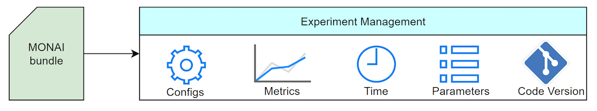

# What's new in 1.1 🎉🎉

- Digital pathology workflows
- Experiment management for MONAI bundle
- Auto3dSeg enhancements
- New models in MONAI Model Zoo
- State-of-the-art SurgToolLoc solution

## Digital pathology workflows

Hover-Net is a model for simultaneous segmentation and classification of nuclei in multi-tissue histology images (Graham et al. Medical Image Analysis, 2019).
We have added support for this model in MONAI by implementing several new components, enhancing existing ones and providing pipelines and examples for training, validation and inference.

Along with the modules release, new digital pathology analysis tutorials are made available:

- [HoVerNet pipelines](https://github.com/Project-MONAI/tutorials/tree/main/pathology/hovernet) based on MONAI workflows for training, validation and inference
- [HoVerNet tutorial](https://github.com/Project-MONAI/tutorials/blob/main/pathology/hovernet/hovernet_torch.ipynb) for training, validation and inference
- NuClick (Interactive Annotation for Pathology) tutorials for [training](https://github.com/Project-MONAI/tutorials/blob/main/pathology/nuclick/nuclick_training_notebook.ipynb)
and [inference](https://github.com/Project-MONAI/tutorials/blob/main/pathology/nuclick/nuclick_infer.ipynb)
- Nuclei classification tutorials for [training](https://github.com/Project-MONAI/tutorials/blob/main/pathology/nuclick/nuclei_classification_training_notebook.ipynb)
and [inference](https://github.com/Project-MONAI/tutorials/blob/main/pathology/nuclick/nuclei_classification_infer.ipynb)

## Experiment management for MONAI bundle

In this release, experiment management features are integrated with MONAI bundle.
It provides essential APIs for managing the end-to-end model bundle lifecycle.
Users can start tracking experiments by, for example, appending `--tracking "mlflow"` to the training or inference commands to enable the MLFlow-based management.
By default, MLFlow will track the executed bundle config, model quality measurements, and source code versioning.
For more details, please refer to the [tutorial](https://github.com/Project-MONAI/tutorials/blob/main/experiment_management/bundle_integrate_mlflow.ipynb).

## Auto3dSeg enhancements

Multiple improvements have been added in `Auto3DSeg` both in terms of
usability and performance.
- Multi-modality support is added and applied for
automated segmentation of the HECKTOR22 challenge dataset, which includes input 3D
CT and PET images of various resolutions and sizes. A tutorial example of
running Auto3DSeg on the HECKTOR22 challenge dataset is available in MONAI
Tutorials. The tutorial is based on [the HECKTOR22 challenge 1st place solution](https://arxiv.org/abs/2209.10809).
- A new improved version of `Segresnet` Algo is now available in `AutoRunner`.
In this version, data caching is more efficient and the preprocessing transforms are more flexible.
The workflow progresses including the timings of steps are written to console output as well as a YAML file.
- Automatic customization and optimization of the model training configuration
can be achieved according to the GPU devices used. The feature
focuses on determining parameters including batch size of model
training and sliding-window inference, allocated devices for
data in sliding-window inference. For more details about how to enable it, please see [the tutorials](https://github.com/Project-MONAI/tutorials/tree/main/auto3dseg).

## New models in MONAI Model Zoo

New pretrained models are being created and released [in the Model Zoo](https://monai.io/model-zoo.html).
Notably,

- The `mednist_reg` model demonstrates how to build image registration workflows in MONAI bundle
format. The model uses a ResNet and spatial transformer for hand X-ray image registration based on
[the registration_mednist tutorial](https://github.com/Project-MONAI/tutorials/blob/main/2d_registration/registration_mednist.ipynb),
- `pathology_nuclei_segmentation_and_classification`,
  `pathology_nuclick_annotation`, and `pathology_nuclei_classification` bundles
  are built for [digital pathology image
  analysis](https://github.com/Project-MONAI/model-zoo/tree/dev/models/pathology_nuclei_segmentation_classification).

For more details about how to use the models, please see [the tutorials](https://github.com/Project-MONAI/tutorials/tree/main/model_zoo).

## State-of-the-art SurgToolLoc solution

[SurgToolLoc](https://surgtoolloc.grand-challenge.org/Home/) is a part of the
[EndoVis](https://endovis.grand-challenge.org/) challenge at [MICCAI 2022](https://conferences.miccai.org/2022/en/).
The challenge focuses on endoscopic video analysis and is divided into (1) fully supervised tool classification
and (2) weakly supervised tool classification/localization.
Team NVIDIA won prizes by finishing [third](https://surgtoolloc.grand-challenge.org/results/) in both categories.
The core components of the solutions [are released in MONAI](https://github.com/Project-MONAI/tutorials/tree/main/competitions/MICCAI/surgtoolloc).
