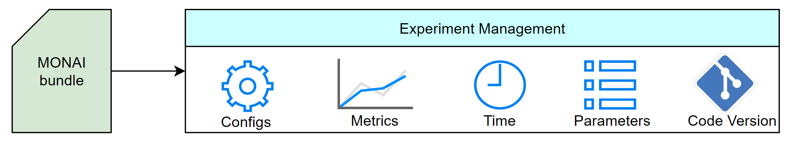

# What's new in 1.1 🎉🎉

- Experiment Management for MONAI bundle

## Experiment Management for MONAI bundle

In this release, we support the experiment management for MONAI bundle. It can help to track the experiment process so that users can easily reproduce experiments that have been done before and can easily retrace the information like hyper parameters and metrics of previous experiments. The default experiment management tool is [MLFLow](https://mlflow.org/docs/latest/tracking.html). Users can enable the MLFlow tracking by simply adding the `--tracking "mlflow"` option in the end of training or inference command lines. By default, MLFlow will record executed bundle config, metrics, parameters, starting time and code version of the running experiment. For more details about it, please refer to this [tutorial](https://github.com/Project-MONAI/tutorials/blob/main/experiment_management/bundle_integrate_mlflow.ipynb). In addition, users can also add support for other experiment management tools by adding a handler referring to [MLFlowHandler](https://docs.monai.io/en/stable/handlers.html#mlflow-handler) and the default settings referring to the `DEFAULT_MLFLOW_SETTINGS`.
