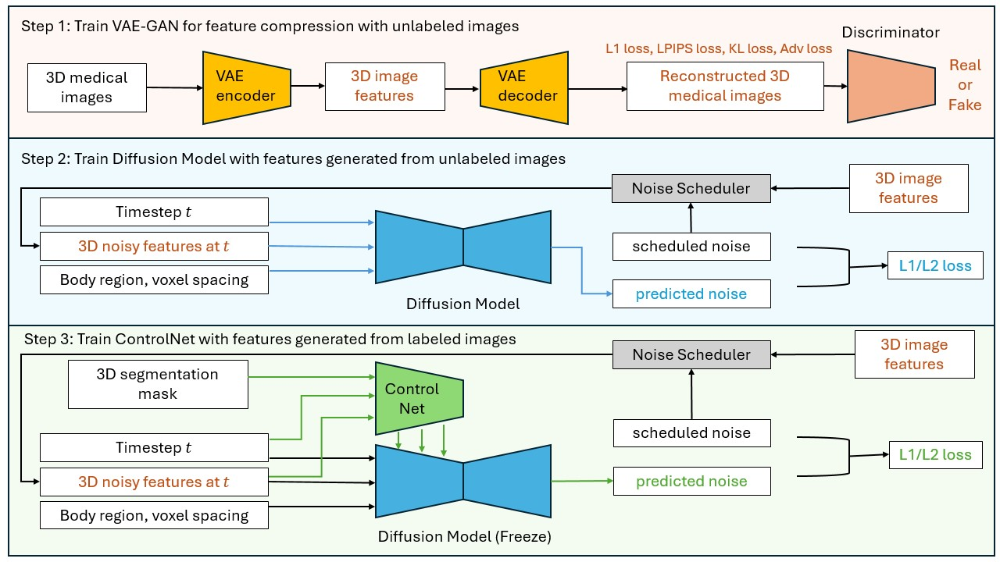
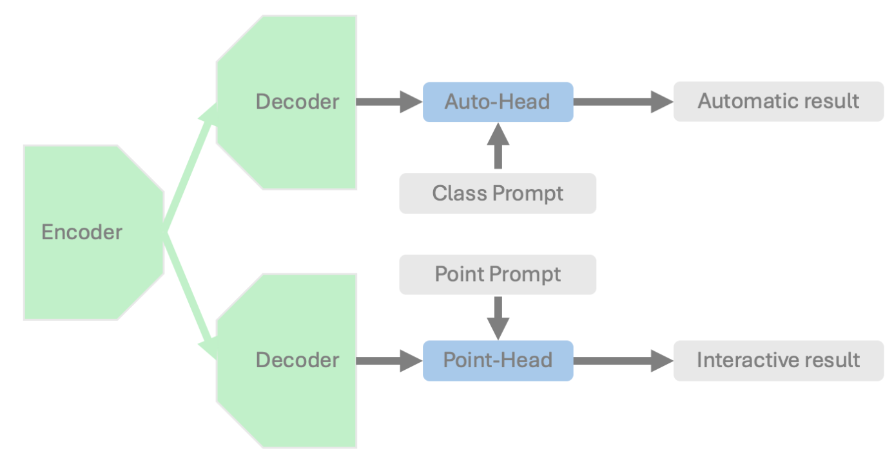
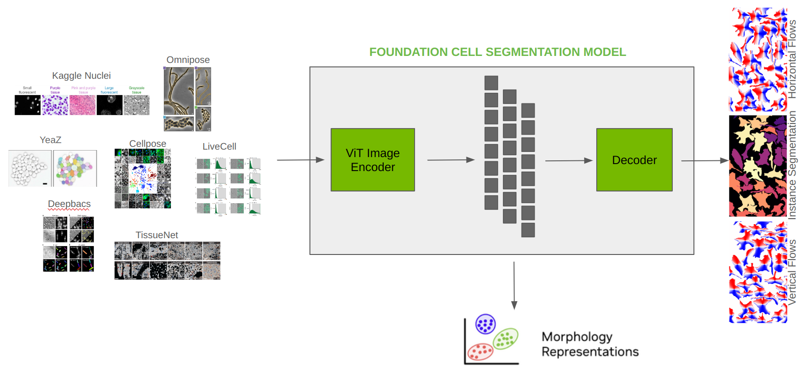

# What's new in 1.4

- MAISI: state-of-the-art 3D Latent Diffusion Model
- VISTA-3D: interactive foundation model for segmenting and anotating human anatomies
- VISTA-2D: cell segmentation pipeline
- Integrating MONAI Generative into MONAI core
- Lazy TensorRT export via `trt_compile`
- Geometric Data Support

## MAISI: state-of-the-art 3D Latent Diffusion Model

MAISI (Medical AI for Synthetic Imaging) is a state-of-the-art three-dimensional (3D) Latent Diffusion Model designed for generating high-quality synthetic CT images with or without anatomical annotations. This AI model excels in data augmentation and creating realistic medical imaging data to supplement limited datasets due to privacy concerns or rare conditions. It can also significantly enhance the performance of other medical imaging AI models by generating diverse and realistic training data.

A tutorial for generating large CT images accompanied by corresponding segmentation masks using MAISI is provided within
[`project-monai/tutorials`](https://github.com/Project-MONAI/tutorials/blob/main/generation/maisi).
It contains the following features:
- A foundation Variational Auto-Encoder (VAE) model for latent feature compression that works for both CT and MRI with flexible volume size and voxel size
- A foundation Diffusion model that can generate large CT volumes up to 512 × 512 × 768 size, with flexible volume size and voxel size
- A ControlNet to generate image/mask pairs that can improve downstream tasks, with controllable organ/tumor size

## VISTA-3D: state-of-the-art 3D Latent Diffusion Model

VISTA-3D is a specialized interactive foundation model for 3D medical imaging. It excels in providing accurate and adaptable segmentation analysis across anatomies and modalities. Utilizing a multi-head architecture, VISTA-3D adapts to varying conditions and anatomical areas, helping guide users' annotation workflow.

A tutorial showing how to finetune VISTA-3D on spleen dataset is provided within
[`project-monai/tutorials`](https://github.com/Project-MONAI/tutorials/blob/main/vista_3d).
It supports three core workflows:
- Segment everything: Enables whole body exploration, crucial for understanding complex diseases affecting multiple organs and for holistic treatment planning.
- Segment using class: Provides detailed sectional views based on specific classes, essential for targeted disease analysis or organ mapping, such as tumor identification in critical organs.
- Segment point prompts: Enhances segmentation precision through user-directed, click-based selection. This interactive approach accelerates the creation of accurate ground-truth data, essential in medical imaging analysis.

## VISTA-2D: cell segmentation pipeline

VISTA-2D is a comprehensive training and inference pipeline for cell segmentation in imaging applications. For more information, refer to this [Blog](https://developer.nvidia.com/blog/advancing-cell-segmentation-and-morphology-analysis-with-nvidia-ai-foundation-model-vista-2d/)

Key features of the model include:
- A robust deep learning algorithm utilizing transformers
- Foundational model as compared to specialist models
- Supports a wide variety of datasets and file formats
- Capable of handling multiple imaging modalities
- Multi-GPU and multinode training support

A tutorial demonstrating how to train a cell segmentation model using the MONAI framework on the Cellpose dataset can be found in [`project-monai/tutorials`](https://github.com/Project-MONAI/tutorials/blob/main/vista_2d).

## Integrating MONAI Generative into MONAI Core

Key modules originally developed in the [MONAI GenerativeModels](https://github.com/Project-MONAI/GenerativeModels) repository have been integrated into the core MONAI codebase. This integration ensures consistent maintenance and streamlined release of essential components for generative AI. In this version, all utilities, networks, diffusion schedulers, inferers, and engines have been migrated into the core codebase. Special care has been taken to ensure saved weights from models trained using GenerativeModels can be loaded into those now integrated into core.

Additionally, several tutorials have been ported and are available within [`project-monai/tutorials`](https://github.com/Project-MONAI/tutorials/blob/main/generation)

## Lazy TensorRT export via `trt_compile`
This release expands TensorRT optimization options for MONAI bundles with `trt_compile` API.
The existing `trt_export` API requires the user to run a separate export script to prepare a TensorRT engine-based TorchScript model.
`trt_compile` builds and saves a TensorRT engine the first time a bundle is run and provides limited dependency support.
It also allows partial TensorRT export where only a certain submodule is being optimized, which improves usability.
A few bundles in the MONAI model zoo, like the new [VISTA-3D](https://github.com/Project-MONAI/model-zoo/tree/dev/models/vista3d)
and [VISTA-2D](https://github.com/Project-MONAI/model-zoo/tree/dev/models/vista2d) bundles, already come with `trt_inference.json` config files which use `trt_compile`.

## Geometric Data Support

MONAI introduces support for geometric data transformations as a key feature. As a starting point, ApplyTransformToPoints transform is added to facilitate matrix operations on points, enabling flexible and efficient handling of geometric transformations. Alongside this, the framework now supports conversions between boxes and points, providing seamless interoperability within detection pipelines. These updates have been integrated into existing pipelines, such as the [detection tutorial](https://github.com/Project-MONAI/tutorials/blob/main/detection) and the [3D registration workflow](https://github.com/Project-MONAI/tutorials/blob/main/3d_registration/learn2reg_nlst_paired_lung_ct.ipynb), leveraging the latest APIs for improved functionality.
