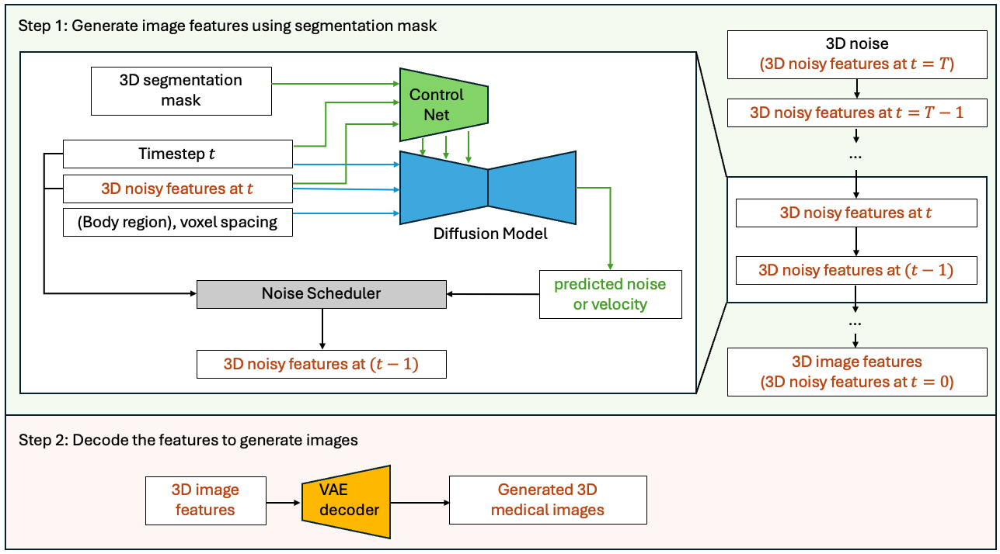

# What's new in 1.5 🎉🎉

- MAISI inference accelerate
- Support numpy 2.x and Pytorch 2.6
- bundles storage changed to huggingface and correspoinding api updated in core
- Ported remaining generative tutorials and bundles
- New tutorials:
  - [2d_regression/image_restoration.ipynb](https://github.com/Project-MONAI/tutorials/blob/main/2d_regression/image_restoration.ipynb)
  - [generation/2d_diffusion_autoencoder/2d_diffusion_autoencoder_tutorial.ipynb](https://github.com/Project-MONAI/tutorials/blob/main/generation/2d_diffusion_autoencoder/2d_diffusion_autoencoder_tutorial.ipynb)
  - [generation/3d_ddpm/3d_ddpm_tutorial.ipynb](https://github.com/Project-MONAI/tutorials/blob/main/generation/3d_ddpm/3d_ddpm_tutorial.ipynb)
  - [generation/classifier_free_guidance/2d_ddpm_classifier_free_guidance_tutorial.ipynb](https://github.com/Project-MONAI/tutorials/blob/main/generation/classifier_free_guidance/2d_ddpm_classifier_free_guidance_tutorial.ipynb)
  - [hugging_face/finetune_vista3d_for_hugging_face_pipeline.ipynb](https://github.com/Project-MONAI/tutorials/blob/main/hugging_face/finetune_vista3d_for_hugging_face_pipeline.ipynb)
  - [hugging_face/hugging_face_pipeline_for_monai.ipynb](https://github.com/Project-MONAI/tutorials/blob/main/hugging_face/hugging_face_pipeline_for_monai.ipynb)
  - [modules/omniverse/omniverse_integration.ipynb](https://github.com/Project-MONAI/tutorials/blob/main/modules/omniverse/omniverse_integration.ipynb)
- New Bundles:
  - [models/cxr_image_synthesis_latent_diffusion_model](https://github.com/Project-MONAI/model-zoo/blob/dev/models/cxr_image_synthesis_latent_diffusion_model)
  - [models/mednist_ddpm](https://github.com/Project-MONAI/model-zoo/blob/dev/models/mednist_ddpm)
  - [models/brain_image_synthesis_latent_diffusion_model](https://github.com/Project-MONAI/model-zoo/blob/dev/models/mednist_ddpm)
  - [hf_models/exaonepath-crc-msi-predictor](https://github.com/Project-MONAI/model-zoo/blob/dev/hf_models/exaonepath-crc-msi-predictor)
  - All existing bundles are also now [hosted on Huggingface](https://huggingface.co/MONAI)!

## Supported Dependency Versions

This release adds support for NumPy 2.0 and PyTorch 2.6. We plan to add support for PyTorch 2.7 in an upcoming version once some compatibility issues have been addressed.

As stated in the updated [README.md](https://github.com/Project-MONAI/MONAI/blob/main/README.md) file, MONAI's policy for the support of dependency versions has been updated for clarity.

MONAI will continue to support [currently supported versions of Python](https://devguide.python.org/versions), and for other dependencies the following apply:

* Major releases of MONAI will have dependency versions stated for them. The current state of the `dev` branch in this repository is the unreleased development version of MONAI which typically will support current versions of dependencies and include updates and bug fixes to do so.
* PyTorch support covers [the current version](https://github.com/pytorch/pytorch/releases) plus three previous minor versions. If compatibility issues with a PyTorch version and other dependencies arise, support for a version may be delayed until a major release.
* Our support policy for other dependencies adheres for the most part to [SPEC0](https://scientific-python.org/specs/spec-0000), where dependency versions are supported where possible for up to two years. Discovered vulnerabilities or defects may require certain versions to be explicitly not supported.
* See the `requirements*.txt` files for dependency version information.

## MAISI Update: Introducing MAISI Version maisi3d-rflow

We are excited to announce the release of MAISI Version _maisi3d-rflow_. This update brings significant improvements over the previous version, _maisi3d-ddpm_, with a remarkable 33x acceleration in latent diffusion model inference speed. The MAISI VAE remains unchanged. Here are the key differences:
  1. Scheduler Update:

     * _maisi3d-ddpm_: Uses the basic DDPM noise scheduler.

     * _maisi3d-rflow_: Introduces the Rectified Flow scheduler, allowing diffusion model inference to be 33 times faster.
  2. Training Data Preparation:

     * _maisi3d-ddpm_: Requires training images to be labeled with body regions (specifically “top_region_index” and “bottom_region_index”).

     * _maisi3d-rflow_: No such labeling is required, making it easier to prepare the training data.
  3. Image Quality:

     * For the released model weights, _maisi3d-rflow_ generates better-quality images for head regions and smaller output volumes compared to _maisi3d-ddpm_. For other regions, the image quality is comparable.
  4. Modality Input:

     * _maisi3d-rflow_ adds a new modality input to the diffusion model, offering flexibility for future extensions to other modalities. Currently, this input is set to always equal 1, as this version supports CT generation exclusively.