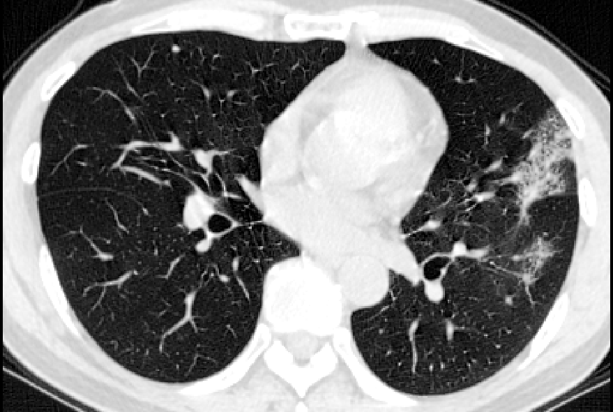
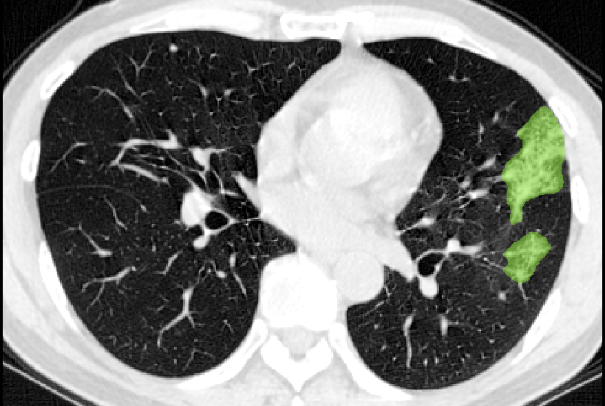

# COPLE-Net for COVID-19 Pneumonia Lesion Segmentation

> If you use this work in your research, please cite the paper.

A reimplementation of the COPLE-Net originally proposed by:

G. Wang, X. Liu, C. Li, Z. Xu, J. Ruan, H. Zhu, T. Meng, K. Li, N. Huang, S. Zhang. (2020)
"A Noise-robust Framework for Automatic Segmentation of COVID-19 Pneumonia Lesions from CT Images."
IEEE Transactions on Medical Imaging. 2020. DOI: [10.1109/TMI.2020.3000314](https://doi.org/10.1109/TMI.2020.3000314)

This research prototype is adapted from:
- [The `HiLab-git/COPLE-Net` GitHub repo](https://github.com/HiLab-git/COPLE-Net/)
- [PyMIC, a Pytorch-based toolkit for medical image computing.](https://github.com/HiLab-git/PyMIC)

To run the inference demo:

- install the latest version of MONAI: `git clone https://github.com/Project-MONAI/MONAI` and `pip install -e .`.
- download the input examples from [google drive folder](https://drive.google.com/drive/folders/1pIoSSc4Iq8R9_xXo0NzaOhIHZ3-PqqDC) to `./images`.
- download the adapted pretrained model from [google drive folder](https://drive.google.com/drive/folders/1HXlYJGvTF3gNGOL0UFBeHVoA6Vh_GqEw) to `./model`.
- run `python run_inference.py` and segmentation results will be saved at `./output`.

("To segment COVID-19 pneumonia lesions from your own data, make sure that the images have been cropped into the lung region,
 and the intensity has been normalized into [0, 1] using window/level of 1500/-650.")
