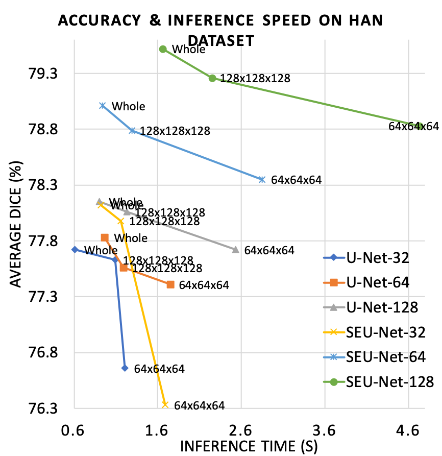

# LAMP: Large Deep Nets with Automated Model Parallelism for Image Segmentation

<p>

</p>


> If you use this work in your research, please cite the paper.

A reimplementation of the LAMP system originally proposed by:

Wentao Zhu, Can Zhao, Wenqi Li, Holger Roth, Ziyue Xu, and Daguang Xu (2020)
"LAMP: Large Deep Nets with Automated Model Parallelism for Image Segmentation."
MICCAI 2020 (Early Accept, paper link: https://arxiv.org/abs/2006.12575)


## To run the demo:

### Prerequisites
- install the latest version of MONAI: `git clone https://github.com/Project-MONAI/MONAI` and `pip install -e .`
- `pip install torchgpipe`

### Data
```bash
mkdir ./data;
cd ./data;
```
Head and Neck CT dataset

Please download and unzip the images into `./data` folder.

- `HaN.zip`: https://drive.google.com/file/d/1A2zpVlR3CkvtkJPvtAF3-MH0nr1WZ2Mn/view?usp=sharing
```bash
unzip HaN.zip;  # unzip
```

Please find more details of the dataset at https://github.com/wentaozhu/AnatomyNet-for-anatomical-segmentation.git


### Minimal hardware requirements for full image training
- U-Net (`n_feat=32`): 2x 16Gb GPUs
- U-Net (`n_feat=64`): 4x 16Gb GPUs
- U-Net (`n_feat=128`): 2x 32Gb GPUs


### Commands
The number of features in the first block (`--n_feat`) can be 32, 64, or 128.
```bash
mkdir ./log;
python train.py --n_feat=128 --crop_size='64,64,64' --bs=16 --ep=4800  --lr=0.001 > ./log/YOURLOG.log
python train.py --n_feat=128 --crop_size='128,128,128' --bs=4 --ep=1200 --lr=0.001 --pretrain='./HaN_32_16_1200_64,64,64_0.001_*'  > ./log/YOURLOG.log
python train.py --n_feat=128 --crop_size='-1,-1,-1' --bs=1 --ep=300 --lr=0.001 --pretrain='./HaN_32_16_1200_64,64,64_0.001_*' > ./log/YOURLOG.log
```
